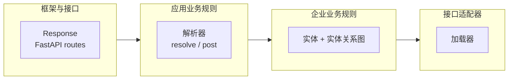
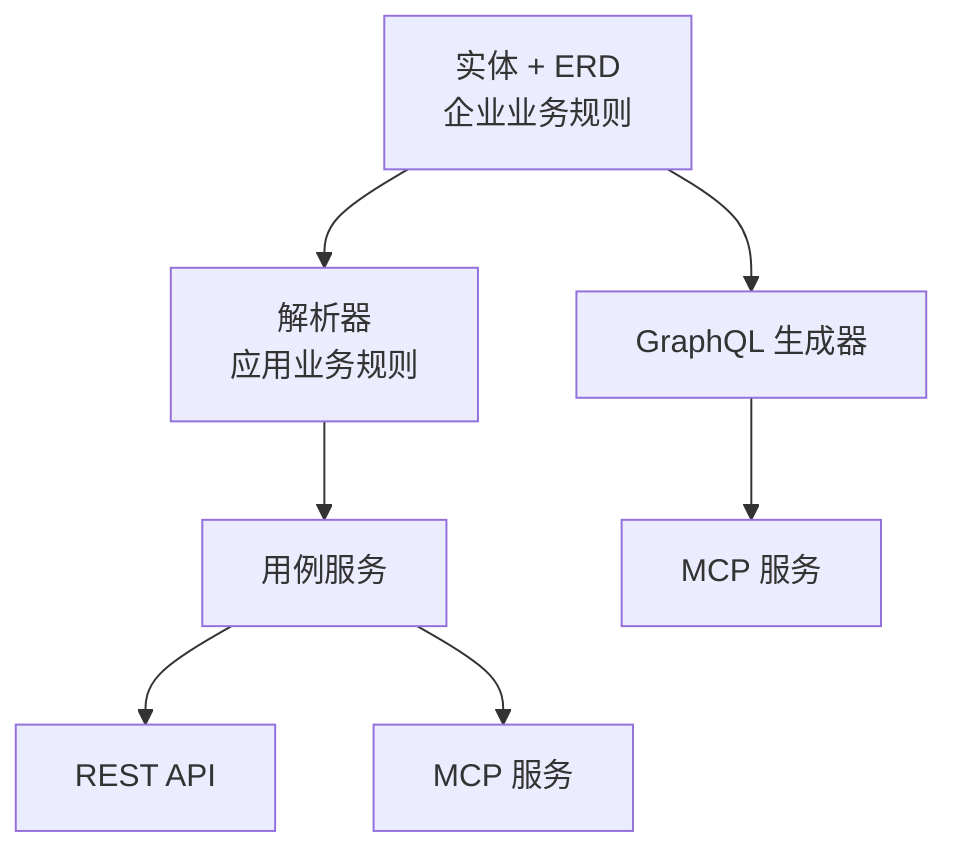

# Pydantic Resolve

> Python 的整洁架构框架 —— 定义业务实体，声明关系，让框架组装数据。

[](https://pypi.python.org/pypi/pydantic-resolve)
[](https://pepy.tech/projects/pydantic-resolve)

[](https://github.com/allmonday/pydantic_resolve/actions/workflows/ci.yml)

[English](./README.md)

**要求：** Python 3.10+, Pydantic v2

---

## 缺失的那一层

大多数 FastAPI 项目遵循相同的模式：先定义 SQLAlchemy ORM 模型，然后创建 Pydantic schema 来镜像它们。这种"ORM-First"的做法如此普遍，以至于很多开发者从未质疑过它。但随着项目规模增长，它会产生一系列系统性问题：

| # | 问题 | 违反的整洁架构原则 |
|---|------|------------------|
| 1 | Schema 被动跟随 ORM —— 同一字段定义两次 | API 契约（框架与接口层）被绑定到数据库设计（接口适配器层） |
| 2 | 业务概念丢失 —— 前端看到 `owner_id` 而不是"任务有负责人" | 企业业务规则层被数据库结构渗透 |
| 3 | 数据组装无处安放 —— join 逻辑散落在 Repository / Service / Route 中 | 应用业务规则层缺失 |
| 4 | 多数据源难以统一 —— 每新增一个数据源就要到处写转换代码 | 没有统一的接口适配器抽象 |
| 5 | Schema 复用困难 —— UserSummary / UserDetail / UserAvatar 靠复制粘贴 | 没有企业实体作为框架响应的源头 |

这些不是个别的工具问题。它们的共同根源是：**系统缺少一个独立于数据库的企业业务规则层**。用整洁架构的术语来说，框架层（ORM）已经侵占了企业层。

```python
# 数据组装的困境：这段逻辑该放在哪里？
@router.get("/tasks")
async def get_tasks():
    tasks = await task_service.get_tasks()

    # 收集 ID、批量查询、构建映射、组装结果...
    user_ids = list({t.owner_id for t in tasks})
    users = await user_service.get_users_by_ids(user_ids)
    user_map = {u.id: u for u in users}

    result = []
    for task in tasks:
        task_dict = task.model_dump()
        task_dict['owner'] = user_map.get(task.owner_id)
        result.append(TaskResponse(**task_dict))
    return result
```

无论这段代码放在 Repository、Service 还是 Route 里，问题都一样：传统三层架构中，数据组装逻辑没有合适的位置。

## 整洁架构层次映射

**pydantic-resolve** 提供了缺失的那一层。它的组件与整洁架构一一对应：

| 整洁架构层次 | pydantic-resolve 组件 |
|-------------|---------------------|
| 企业业务规则 | 实体 + 实体关系图 |
| 应用业务规则 | 解析器 + resolve/post |
| 接口适配器 | 加载器（数据访问） |
| 框架与接口 | FastAPI 路由 + GraphQL + MCP |



依赖方向始终指向内层：实体不认识加载器。加载器不认识 FastAPI。FastAPI 不认识数据库。

完整的架构分析请参阅 [Python 整洁架构](./docs/architecture_entity_first.zh.md)。

---

## pydantic-resolve 如何实现

**pydantic-resolve** 提供三个机制 —— 每个整洁架构层次一个：

| 你需要什么 | 你写什么 | 整洁架构层次 | 框架负责什么 |
|------|----------|-------------|------------|
| 加载关联数据 | `resolve_*` + `Loader(...)` | 接口适配器 | 批量查询并把结果映射回去 |
| 计算派生字段 | `post_*` | 应用业务规则 | 在后代节点完全解析后运行 |
| 复用关系声明 | 实体关系图 + `AutoLoad` | 企业业务规则 | 为多个模型集中管理关系连线 |

同一张 ERD 还能驱动 GraphQL 查询、MCP 服务和管理后台：



### 改造前后对比

```python
# 改造前：在路由中手动组装 N+1（框架层知道数据库）
@router.get("/tasks")
async def get_tasks():
    tasks = await task_service.get_tasks()
    user_ids = list({t.owner_id for t in tasks})
    users = await user_service.get_users_by_ids(user_ids)
    user_map = {u.id: u for u in users}
    return [
        TaskResponse(**{**t.model_dump(), 'owner': user_map.get(t.owner_id)})
        for t in tasks
    ]
```

```python
# 改造后：声明缺失字段，让框架组装（层次保持整洁）
class TaskView(BaseModel):
    id: int
    title: str
    owner_id: int
    owner: Optional[UserView] = None

    def resolve_owner(self, loader=Loader(user_loader)):  # 接口适配器
        return loader.load(self.owner_id)

@router.get("/tasks")
async def get_tasks():
    tasks = [TaskView.model_validate(t) for t in await task_repo.get_tasks()]
    return await Resolver().resolve(tasks)  # 应用业务规则
```

改造后的优势：

- **责任分离**：数据加载逻辑从路由移入模型，路由只负责调度
- **声明式组装**：`resolve_*` 声明"需要什么数据"，框架负责"怎么批量获取"
- **可读性与可维护性**：字段定义与数据来源在同一个类中，一目了然

## 快速开始

### 安装

```bash
pip install pydantic-resolve
pip install pydantic-resolve[mcp]  # 包含 MCP 支持
```

### 示例说明

在快速开始中，我们构建一个 API：

- `Sprint` 有多个 `Task`
- `Task` 有一个 `owner`（一个 `User`）
- 接口还需要 `task_count`、`contributors` 这类派生字段

期望的响应结构：

```json
{
  "id": 1,
  "name": "Sprint 1",
  "tasks": [
    {
      "id": 101,
      "title": "实现登录功能",
      "owner_id": 1,
      "owner": {
        "id": 1,
        "name": "Alice"
      }
    }
  ],
  "task_count": 1,
  "contributor_names": ["Alice"]
}
```

每个步骤都在前一步代码基础上增加一个概念。

### Step 1：用 `resolve_*` 加载关联数据 —— *接口适配器*

每个响应模型都有一些字段已经填充（来自数据库、来自用户输入），还有一些字段需要单独获取。`resolve_*` 就是你声明那些缺失字段的方式 —— 它是你的接口适配器。

```python
from typing import Optional

from pydantic import BaseModel
from pydantic_resolve import Loader, Resolver, build_object


class UserView(BaseModel):
    id: int
    name: str


async def user_loader(user_ids: list[int]):
    users = await db.query(User).filter(User.id.in_(user_ids)).all()
    return build_object(users, user_ids, lambda user: user.id)


class TaskView(BaseModel):
    id: int
    title: str
    owner_id: int
    owner: Optional[UserView] = None

    def resolve_owner(self, loader=Loader(user_loader)):
        return loader.load(self.owner_id)


tasks = [TaskView.model_validate(task) for task in raw_tasks]
tasks = await Resolver().resolve(tasks)
```

这就是整个库最核心的工作方式：

- `owner` 当前缺数据，所以你声明如何加载它。
- `user_loader` 会一次性收到所有被请求到的 `owner_id`。
- `Resolver().resolve(...)` 负责遍历模型树并补全字段。

一个很好用的心智模型是：**`resolve_*` 的含义就是"这个字段需要从当前节点之外拿数据"。**

### Step 2：组装嵌套树 —— *应用业务规则*

真实的 API 很少只有一层关系。当 `Sprint` 包含多个 `Task`，而每个 `Task` 已经知道如何加载 `owner` 时，解析器会遍历整棵树并递归地批量加载所有数据。

```python
from typing import List

from pydantic_resolve import build_list


async def task_loader(sprint_ids: list[int]):
    tasks = await db.query(Task).filter(Task.sprint_id.in_(sprint_ids)).all()
    return build_list(tasks, sprint_ids, lambda task: task.sprint_id)


class SprintView(BaseModel):
    id: int
    name: str
    tasks: List[TaskView] = []

    def resolve_tasks(self, loader=Loader(task_loader)):
        return loader.load(self.id)


sprints = [SprintView.model_validate(sprint) for sprint in raw_sprints]
sprints = await Resolver().resolve(sprints)
```

**结果：** 无论加载多少个 sprint 或 task，每个 loader 只执行一次查询。

这也是为什么 `resolve_*` 是最佳的入门点。你在学习任何高级功能之前，就能先获得实际收益。

### Step 3：用 `post_*` 计算派生字段 —— *应用业务规则*

`task_count` 和 `contributor_names` 不是从某个查询直接查出来的 —— 它们是从模型已有的数据推导出来的。`post_*` 处理这些：它在所有嵌套的 `resolve_*` 调用完成**之后**运行。

```python
class SprintView(BaseModel):
    id: int
    name: str
    tasks: List[TaskView] = []
    task_count: int = 0
    contributor_names: list[str] = []

    def resolve_tasks(self, loader=Loader(task_loader)):
        return loader.load(self.id)

    def post_task_count(self):
        return len(self.tasks)

    def post_contributor_names(self):
        return sorted({task.owner.name for task in self.tasks if task.owner})
```

执行顺序：

1. `resolve_tasks` 把该 sprint 的 tasks 加载出来。
2. 每个 `TaskView.resolve_owner` 把各自的 owner 加载出来。
3. `post_task_count` 和 `post_contributor_names` 在这些嵌套字段都准备好之后运行。

| | `resolve_*` | `post_*` |
|---|---|---|
| 需要外部 IO 吗？ | 是 | 通常不需要 |
| 在后代准备好之前运行？ | 是 | 否 |
| 适合做计数、求和、格式化吗？ | 有时可以 | 是 |
| 返回值会继续被解析吗？ | 会 | 不会 |

这两个模式已经能覆盖大部分 API 接口。下一节介绍跨层数据流 —— 如果你暂时不需要，可以直接跳到[实体关系图](#企业业务规则实体关系图--autoload)。

### Step 4：父子节点协作 —— *横切关注点*

当父节点和子节点需要共享数据、又不想写死相互引用时：

- `ExposeAs`：把祖先数据向下传递
- `SendTo` + `Collector`：把子孙数据向上汇总

```python
from typing import Annotated

from pydantic_resolve import Collector, ExposeAs, SendTo


class SprintView(BaseModel):
    id: int
    name: Annotated[str, ExposeAs('sprint_name')]
    tasks: List[TaskView] = []
    contributors: list[UserView] = []

    def resolve_tasks(self, loader=Loader(task_loader)):
        return loader.load(self.id)

    def post_contributors(self, collector=Collector('contributors')):
        return collector.values()


class TaskView(BaseModel):
    id: int
    title: str
    owner_id: int
    owner: Annotated[Optional[UserView], SendTo('contributors')] = None
    full_title: str = ""

    def resolve_owner(self, loader=Loader(user_loader)):
        return loader.load(self.owner_id)

    def post_full_title(self, ancestor_context):
        return f"{ancestor_context['sprint_name']} / {self.title}"
```

当树的形状本身很重要时使用这个功能 —— 例如，子节点需要祖先上下文（sprint 名称、权限信息），或父节点需要聚合多个后代节点的值（全部贡献者、全部标签）。

## 企业业务规则：实体关系图 + AutoLoad

实体关系图 + `AutoLoad` 是整洁架构企业业务规则层完全成型的地方：关系成为稳定的内核，每个 Response 都只是同一张实体图的不同视图。

到这里为止，Core API 已经足够实用。只有当你发现关系定义开始在多个响应模型里反复出现时，才值得继续往 ERD 模式走。

一个很常见的信号是，你开始看到同样的关系被反复描述：

- `TaskCard.resolve_owner`
- `TaskDetail.resolve_owner`
- `SprintBoard.resolve_tasks`
- `SprintReport.resolve_tasks`

到那时，问题已经不再是"这个字段怎么加载"，而是"关系的唯一事实来源应该放在哪里"。

### 成本与收益

| 问题 | 手写 Core API | 实体关系图 + `AutoLoad` |
|------|-------------|----------------------|
| 第一个接口上手速度 | 更快 | 更慢 |
| 前期配置成本 | 低 | 中 |
| 同一关系在多个模型里复用 | 容易重复 | 可以集中管理 |
| 后续修改某条关系 | 要改多个 `resolve_*` | 改一处 ERD 声明即可 |
| GraphQL / MCP 生成 | 需要单独处理 | 很自然地延伸出去 |

ERD 模式确实要求你在前期更规范：

- 定义实体类。
- 显式声明关系。
- 从和解析器相同的 `diagram` 里创建 `AutoLoad`。

这些配置成本是实实在在的。对应的收益是：关系知识终于能收敛到一个地方——这正是整洁架构中企业业务规则层（Entity Layer）的职责：定义独立于外部框架的核心业务知识，让数据库、API、GraphQL、MCP 都只是它的不同投影。

### 同一个例子换成 ERD 模式

下面还是同一个 `Sprint -> Task -> User` 例子，只是把关系连线放进实体关系图：

```python
from typing import Annotated, Optional

from pydantic import BaseModel
from pydantic_resolve import Relationship, base_entity, config_global_resolver


BaseEntity = base_entity()


class UserEntity(BaseModel, BaseEntity):
    id: int
    name: str


class TaskEntity(BaseModel, BaseEntity):
    __relationships__ = [
        Relationship(fk='owner_id', name='owner', target=UserEntity, loader=user_loader)
    ]
    id: int
    title: str
    owner_id: int


class SprintEntity(BaseModel, BaseEntity):
    __relationships__ = [
        Relationship(fk='id', name='tasks', target=list[TaskEntity], loader=task_loader)
    ]
    id: int
    name: str


diagram = BaseEntity.get_diagram()
AutoLoad = diagram.create_auto_load()
config_global_resolver(diagram)


class TaskView(TaskEntity):
    owner: Annotated[Optional[UserEntity], AutoLoad()] = None


class SprintView(SprintEntity):
    tasks: Annotated[list[TaskView], AutoLoad()] = []
    task_count: int = 0

    def post_task_count(self):
        return len(self.tasks)
```

和 Core API 版本相比：

- `resolve_owner` 不见了。
- `resolve_tasks` 不见了。
- 关系定义集中到了一个地方。
- `post_*` 的用法完全不变。

如果你还希望把 `owner_id` 这类内部 FK 字段从外部响应里隐藏掉，可以在 ERD 基础上叠加 `DefineSubset`：

```python
from pydantic_resolve import DefineSubset


class TaskSummary(DefineSubset):
    __subset__ = (TaskEntity, ('id', 'title'))
    owner: Annotated[Optional[UserEntity], AutoLoad()] = None
```

### 如果 ORM 本身已经知道关系

当你接受了 ERD 模式的思路，下一步就可以让 ORM 为你描述关系，并导入到企业层：

```python
from pydantic_resolve import ErDiagram
from pydantic_resolve.integration.mapping import Mapping
from pydantic_resolve.integration.sqlalchemy import build_relationship


entities = build_relationship(
    mappings=[
        Mapping(entity=SprintEntity, orm=SprintORM),
        Mapping(entity=TaskEntity, orm=TaskORM),
        Mapping(entity=UserEntity, orm=UserORM),
    ],
    session_factory=session_factory,
)

diagram = ErDiagram(entities=[]).add_relationship(entities)
AutoLoad = diagram.create_auto_load()
config_global_resolver(diagram)
```

`build_relationship` 支持 **SQLAlchemy**、**Django** 和 **Tortoise ORM**。这是一个很好的后续优化步骤：当你的 ORM 元数据已经稳定，而且你不想再重复声明关系时。

## 采纳路径

### 1. 先从接口适配器开始

先在一个接口上手写 `resolve_*` 和 `post_*`。你不需要改变架构，就能立即获得 N+1 保护。

### 2. 准备好时再引入企业业务规则

当关系开始在多个模型里重复出现时，把它们移进 ERD。这是你建立企业层的步骤。

### 3. 让框架吸收 ORM 元数据

当 ORM 稳定后，使用 `build_relationship()` 从数据库层导入已有的关系知识。

**适合进入 ERD 模式的场景：**

- 项目里有 3 个以上相关实体，并且这些关系会在多个响应模型中重复出现。
- 团队需要一个可以共同讨论、共同维护的关系定义中心。
- 你希望 GraphQL 和 MCP 也复用同一张模型关系图。
- 你希望隐藏 FK 字段，同时保留统一的关系声明。

**Core API 通常就足够了：**

- 当前只有少量数据加载需求。
- 你希望每个接口都保持显式、直观。
- 响应结构还在快速变化，暂时不值得抽象。

[→ 完整 ERD 驱动指南](https://allmonday.github.io/pydantic-resolve/erd_driven/)

## 框架与接口：集成

ERD 不仅能够驱动 REST API，还能为 GraphQL 查询、MCP 服务和管理后台提供支持。

### GraphQL

从 ERD 生成 GraphQL schema 并执行查询：

```python
from pydantic_resolve.graphql import GraphQLHandler

handler = GraphQLHandler(diagram)
result = await handler.execute("{ users { id name posts { title } } }")
# result.data == {"users": [{"id": 1, "name": "Alice", "posts": [{"title": "Hello"}]}, ...]}
```

[→ GraphQL 文档](./demo/graphql/README.md)

### MCP

将 GraphQL API 暴露给 AI 代理使用（需要 `pip install pydantic-resolve[mcp]`）：

```python
from pydantic_resolve import AppConfig, create_mcp_server

mcp = create_mcp_server(apps=[AppConfig(name="blog", er_diagram=diagram)])
mcp.run()
# 代理可以查询："列出用户 Alice 的所有文章" → 转换为针对你的 ERD 的 GraphQL 查询
```

[→ MCP 文档](https://allmonday.github.io/pydantic-resolve/api/)

### 可视化

借助 [fastapi-voyager](https://github.com/allmonday/fastapi-voyager) 进行交互式 ERD 浏览：

```python
from fastapi_voyager import create_voyager

app.mount('/voyager', create_voyager(app, er_diagram=diagram))
```

---

## 对比

### Entity-First（pydantic-resolve）vs ORM-First（传统 FastAPI）

| 维度 | ORM-First | Entity-First |
|------|-----------|-------------|
| 类型的唯一事实来源 | ORM 模型 | 实体（Pydantic） |
| 关系连线 | 每个接口重复编写 | 集中在 ERD 中 |
| 数据组装 | 在 Service/Route 中手动完成 | 通过解析器自动完成 |
| N+1 预防 | 手动配置 eager loading | 内置的 DataLoader 批量加载 |
| 多数据源 | 分散的转换代码 | 统一的 Loader 接口 |
| API 契约稳定性 | 绑定数据库 schema | 独立于数据库 |

### pydantic-resolve vs GraphQL

| 特性 | GraphQL | pydantic-resolve |
|---------|---------|------------------|
| **N+1 预防** | 手动配置 DataLoader | 内置自动批量加载 |
| **类型安全** | 需要额外的 schema 文件 | 原生 Pydantic 类型 |
| **学习曲线** | 陡峭（Schema、Resolvers、Loaders） | 适中（需要理解 Loader/批量模式） |
| **调试** | 依赖复杂的内省机制 | 标准 Python 调试方式 |
| **集成** | 需要专用服务器 | 可与任意框架配合 |
| **查询灵活性** | 客户端几乎可以查询任意结构 | 由服务端明确给出 API 契约 |

> **注意：** pydantic-resolve 借用了 GraphQL 生态系统的 DataLoader 批量模式。主要区别在于你可以保留现有的 REST 框架，无需采用完整的 GraphQL 服务器就能获得自动批量加载。如果你的项目已经使用了 strawberry 或 ariadne 并且很满意，pydantic-resolve 可能是多余的。

---

## 资源

- [完整文档](https://allmonday.github.io/pydantic-resolve/)
- [Python 整洁架构（完整论文）](./docs/architecture_entity_first.zh.md)
- [示例项目](https://github.com/allmonday/composition-oriented-development-pattern)
- [在线演示](https://www.fastapi-voyager.top/voyager/)
- [在线演示 - GraphQL](https://www.fastapi-voyager.top/graphql)
- [API 参考](https://allmonday.github.io/pydantic-resolve/api/)

---

## 许可证

MIT License

## 作者

tangkikodo (allmonday@126.com)
