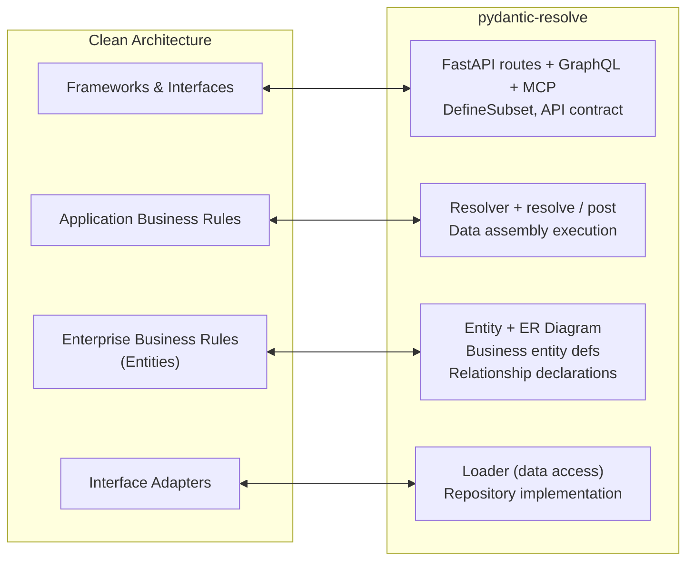

# Clean Architecture for Python: The Entity-First Implementation

[中文版](./architecture_entity_first.zh.md)

## I. Why Clean Architecture Matters for FastAPI

### 1.1 The Missing Enterprise Business Rules Layer

FastAPI projects share a striking structural similarity: SQLAlchemy ORM models come first, then Pydantic schemas are created to mirror them. This "ORM-First" pattern is so common that many developers have never questioned it.

The root problem is a confusion between two levels of abstraction: database models (ORM) and domain models (Entity). ORM models should be implementation details of data persistence, not the center of the architecture. Pydantic schemas should not be shadows of ORM, but independent abstractions that express business concepts and API contracts.

```python
# The data assembly dilemma: where does this logic go?
@router.get("/tasks")
async def get_tasks():
    tasks = await task_service.get_tasks()

    # Collect IDs, batch query, build mapping, assemble result...
    user_ids = list({t.owner_id for t in tasks})
    users = await user_service.get_users_by_ids(user_ids)
    user_map = {u.id: u for u in users}

    result = []
    for task in tasks:
        task_dict = task.model_dump()
        task_dict['owner'] = user_map.get(task.owner_id)
        result.append(TaskResponse(**task_dict))
    return result
```

Whether this code lives in Repository, Service, or Route, the problem is the same: **the system has no Enterprise Business Rules layer independent of the database**. In Clean Architecture terms, the Frameworks layer (ORM) has colonized the Enterprise layer. Data assembly logic has no proper home.

### 1.2 Five Symptoms of Its Absence

| # | Symptom | Clean Architecture Violation |
|---|---------|------------------------------|
| 1 | Schemas passively follow ORM — same fields defined twice | API contract (Frameworks) is tied to DB design (Adapters) |
| 2 | Business concepts lost — frontend sees `owner_id` instead of "task has an owner" | Enterprise Business Rules are permeated by DB structure |
| 3 | Data assembly has no home — join logic scattered across Repository / Service / Route | Application Business Rules layer is missing |
| 4 | Multi-source data is hard — each new source means conversion code everywhere | No unified Interface Adapter abstraction |
| 5 | Schema reuse is hard — copy-paste for UserSummary / UserDetail / UserAvatar | No Enterprise entity to derive Frameworks responses from |

These are not individual tooling issues. They are all consequences of one architectural gap: **the absence of a stable Enterprise Business Rules layer**.

## II. The Layer Map

### 2.1 Clean Architecture to pydantic-resolve: 1:1 Correspondence

pydantic-resolve provides the missing layer. Its components map directly to Clean Architecture:



The dependency direction always points inward — the core principle of Clean Architecture:

- **Entity** does not depend on any framework or database.
- **Resolver** depends on Entity, but Entity is unaware of Resolver.
- **Loader** implementations can be freely replaced without affecting upper layers.
- **Response** depends on Entity, but Entity is unaware of API contracts.

### 2.2 Enterprise Business Rules: Entity + ER Diagram

Entity expresses pure business concepts — "user", "task", "project" — independent of any technical implementation. When we talk about business, we say "this task belongs to a user", not "the tasks table has a user_id foreign key".

```python
from pydantic import BaseModel
from pydantic_resolve import base_entity, Relationship

BaseEntity = base_entity()

class UserEntity(BaseModel):
    id: int
    name: str
    email: str

class TaskEntity(BaseModel, BaseEntity):
    """Relationships are declared on the entity, not scattered across endpoints."""
    __relationships__ = [
        Relationship(
            fk='owner_id',
            target=UserEntity,
            loader=user_loader  # how to load, not where it's stored
        )
    ]
    id: int
    name: str
    owner_id: int
```

Key points:
- Entity is a business concept, not bound to any implementation.
- Relationships are connected through loaders, not DB foreign keys.
- The same entity can express cross-data-source relationships.

### 2.3 Interface Adapters: Loader

Loader is the Adapter in Clean Architecture. It converts external data formats (ORM objects, RPC responses, cache entries) into domain entities. Entity only needs to declare "what data I need", not "where it comes from".

```python
# Load from database
async def user_loader(user_ids: list[int]):
    users = await UserORM.filter(UserORM.id.in_(user_ids))
    return build_object(users, user_ids, lambda u: u.id)

# Or load from RPC
async def user_loader_from_rpc(user_ids: list[int]):
    users = await user_rpc.batch_get_users(user_ids)
    return build_object(users, user_ids, lambda u: u['id'])

# Or load from Redis
async def user_loader_from_cache(user_ids: list[int]):
    users = await redis.mget(f"user:{uid}" for uid in user_ids)
    return build_object(users, user_ids, lambda u: u['id'])
```

When a data source migrates, only the Loader changes. Entity and Response remain untouched.

### 2.4 Application Business Rules: Resolver + resolve/post

Clean Architecture defines Application Business Rules as use-case orchestration. In the "get task list" use case, the orchestrator needs to coordinate data loading for Task, User, Project.

The traditional three-layer architecture has no place for this orchestration:

- **Repository** should only do data access. Adding assembly logic bloats it into a use-case dump.
- **Service** should contain business logic, not repetitive batch-query-and-map code.
- **Route** should handle HTTP concerns, not data assembly.

Resolver fills this gap. It automates the common patterns of data assembly through two mechanisms:

- **`resolve_*`**: declares how to fetch missing data (Interface Adapters interaction).
- **`post_*`**: computes derived fields after the subtree is fully assembled.

```python
class SprintView(BaseModel):
    id: int
    name: str
    tasks: list[TaskView] = []
    task_count: int = 0
    contributor_names: list[str] = []

    def resolve_tasks(self, loader=Loader(task_loader)):
        return loader.load(self.id)

    def post_task_count(self):
        return len(self.tasks)

    def post_contributor_names(self):
        return sorted({task.owner.name for task in self.tasks if task.owner})
```

The Resolver walks the tree: first all `resolve_*` methods load missing data (with automatic batching), then all `post_*` methods compute derived values on the assembled tree.

### 2.5 Frameworks & Interfaces: Response + FastAPI Routes

Response is derived from Entity, not from ORM. It selects a subset of fields and adds use-case-specific extensions:

```python
from pydantic_resolve import DefineSubset

# Scenario 1: User summary (list page)
class UserSummary(DefineSubset):
    __subset__ = (UserEntity, ('id', 'name'))

# Scenario 2: Task list (with owner)
class TaskResponse(DefineSubset):
    __subset__ = (TaskEntity, ('id', 'name', 'estimate'))
    owner: Annotated[Optional[UserSummary], AutoLoad()] = None

# Scenario 3: Task detail (more fields)
class TaskDetailResponse(DefineSubset):
    __subset__ = (TaskEntity, ('id', 'name', 'estimate', 'created_at'))
    owner: Annotated[Optional[UserDetail], AutoLoad()] = None
```

Route code becomes minimal:

```python
@router.get("/tasks", response_model=list[TaskResponse])
async def get_tasks():
    tasks = await query_tasks_from_db()
    tasks = [TaskResponse.model_validate(t) for t in tasks]
    return await Resolver().resolve(tasks)
```

The route does not import SQLAlchemy modules, does not think about loading strategies, and does not write assembly loops. It only declares business semantics: "this task needs an owner".

## III. Before and After: A Practical Comparison

### 3.1 Before: ORM-First

```python
# models/task.py (ORM) — Enterprise + Adapter layers conflated
class TaskORM(Base):
    __tablename__ = 'tasks'
    id = Column(Integer, primary_key=True)
    name = Column(String(100))
    owner_id = Column(Integer, ForeignKey('users.id'))
    project_id = Column(Integer, ForeignKey('projects.id'))
    owner = relationship("UserORM", back_populates="tasks")
    project = relationship("ProjectORM", back_populates="tasks")

# schemas/task.py — Frameworks layer is a shadow of ORM
class TaskResponse(BaseModel):
    id: int
    owner_id: int                    # DB detail leaks into API contract
    project_id: int
    owner: Optional['UserResponse']
    project: Optional['ProjectResponse']

# routes/task.py — Application layer is in the route, mixed with DB concerns
@router.get("/tasks", response_model=list[TaskResponse])
async def get_tasks(session: AsyncSession = Depends(get_session)):
    result = await session.execute(
        select(TaskORM).options(
            selectinload(TaskORM.owner),
            selectinload(TaskORM.project)
        )
    )
    tasks = result.scalars().all()
    return [TaskResponse.model_validate(t) for t in tasks]
```

Notice what the route imports: `selectinload`, `AsyncSession`, ORM models. The Frameworks layer knows about the database.

### 3.2 After: Entity-First with Clean Architecture Layers

```python
# entities/task.py — Enterprise Business Rules layer
class TaskEntity(BaseModel, BaseEntity):
    __relationships__ = [
        Relationship(fk='owner_id', target=UserEntity, name='owner', loader=user_loader),
        Relationship(fk='project_id', target=ProjectEntity, name='project', loader=project_loader),
    ]
    id: int
    name: str
    owner_id: int
    project_id: int

# responses/task.py — Frameworks & Interfaces layer
class TaskResponse(DefineSubset):
    __subset__ = (TaskEntity, ('id', 'name'))
    owner: Annotated[Optional[UserResponse], AutoLoad()] = None
    project: Annotated[Optional[ProjectSummary], AutoLoad()] = None

# routes/task.py — Frameworks layer, no DB imports
@router.get("/tasks", response_model=list[TaskResponse])
async def get_tasks():
    tasks_orm = await query_tasks_from_db()
    tasks = [TaskResponse.model_validate(t) for t in tasks_orm]
    return await Resolver().resolve(tasks)
```

### 3.3 What Changed, Layer by Layer

| Dimension | Before (ORM-First) | After (Entity-First) |
|-----------|---------------------|----------------------|
| **Enterprise** | No entity layer; ORM IS the domain | Entity + ERD as stable core |
| **Application** | Assembly logic scattered in routes/services | Resolver automates orchestration |
| **Adapters** | ORM `relationship` + `selectinload` | Loader with unified interface |
| **Frameworks** | Schema mirrors ORM; route imports DB modules | Response derived from Entity; route is DB-agnostic |

## IV. Architectural Principles

### Dependency Inversion Principle

The core principle of Clean Architecture is "dependency direction points inward":

- Entity does not depend on any framework or database — it is the innermost stable core.
- API layer depends on Entity, but Entity is unaware of API's existence.
- Loader implementations can be freely replaced — upper-level code is unaffected.

In short: Entity doesn't know about Loader. Loader doesn't know about FastAPI. FastAPI doesn't know about the database.

### Separation of Concerns

- **Entity** expresses "what is" — what attributes users have, tasks have owners.
- **Loader** solves "how to do" — where data comes from, how to batch query.
- **Response** defines "what to expose" — what fields the API returns for a specific use case.

### Testability

Since Loader is a unified data access interface, tests can easily mock it. Test cases focus on verifying business logic without starting databases or managing transaction state.

### Evolution Capability

| Evolution scenario | Clean Architecture response | Entity-First implementation |
|-------------------|-----------------------------|---------------------------|
| Database migration | Only modify Adapter | Only modify Loader |
| API upgrade | Only modify Interface/Presenter | Only modify Response |
| Business expansion | Expand Entity and Use Case | Expand Entity and ERD |
| Multi-data source | Add new Adapter | Add new Loader |

## V. Migration Guide

### Step 1: Extract Entity

```python
# Extract business concepts from existing ORM models
class UserEntity(BaseModel):
    id: int
    name: str
    email: str
    # Remove: password_hash, created_at, updated_at
```

### Step 2: Define ERD

```python
class TaskEntity(BaseModel, BaseEntity):
    __relationships__ = [
        Relationship(fk='owner_id', target=UserEntity, name='owner', loader=user_loader),
    ]
```

### Step 3: Refactor Response

```python
class TaskResponse(DefineSubset):
    __subset__ = (TaskEntity, ('id', 'name'))
    owner: Annotated[Optional[UserSummary], AutoLoad()] = None
```

### Step 4: Gradual Replacement

- Keep existing ORM.
- New features use Entity-First.
- Old interfaces gradually refactored.

### Precautions

- Don't refactor all code at once.
- ORM and Entity can coexist.
- Prioritize using Entity-First in new features.

## VI. FAQ

### Q1: Isn't Entity just a copy of ORM?

No. Entity and ORM are fundamentally different:

- Entity is a business concept; ORM is a DB mapping.
- Entity can express relationships that DB cannot express (cross-data sources).
- Entity is the stable core; ORM is a replaceable implementation.

### Q2: Won't this increase code volume?

Initially it might increase, but long-term benefits are greater:

- DefineSubset eliminates duplicate code between ORM and Schema.
- Loaders can be reused across endpoints.

### Q3: Do small projects need this?

Depends on project complexity:

- Simple CRUD: ORM-First is sufficient.
- Complex business logic or multiple data sources: Entity-First is recommended.
- Team collaboration: Entity-First is easier to maintain.

### Q4: How to handle write operations (POST/PUT/PATCH)?

Write operations differ from read operations:

- Write: Can still use ORM or Pydantic schema as DTO.
- Read: Use Entity-First to gain architectural advantages.

## VII. What About SQLModel?

SQLModel is a practical tool that optimizes development experience within the ORM-First framework, but it does not solve the fundamental architectural problems.

**What SQLModel solves**: Type definition duplication and field synchronization — one class serves as both DB model and Pydantic schema.

**What SQLModel cannot solve**:

- Schemas still passively follow ORM — there is no independent business entity layer.
- No unified multi-data source handling — SQLModel only handles SQLAlchemy-connected sources.
- Data assembly dilemma still exists — developers still need manual batch-query-and-map code.
- No schema reuse mechanism — no way to derive field subsets from models.

**Positioning**: SQLModel is "a better ORM-First solution", not an Entity-First solution. It works well for simple CRUD projects with a single data source. For complex business logic, stable API contracts, or multi-data source integration, Entity-First with pydantic-resolve is the more sustainable choice.
