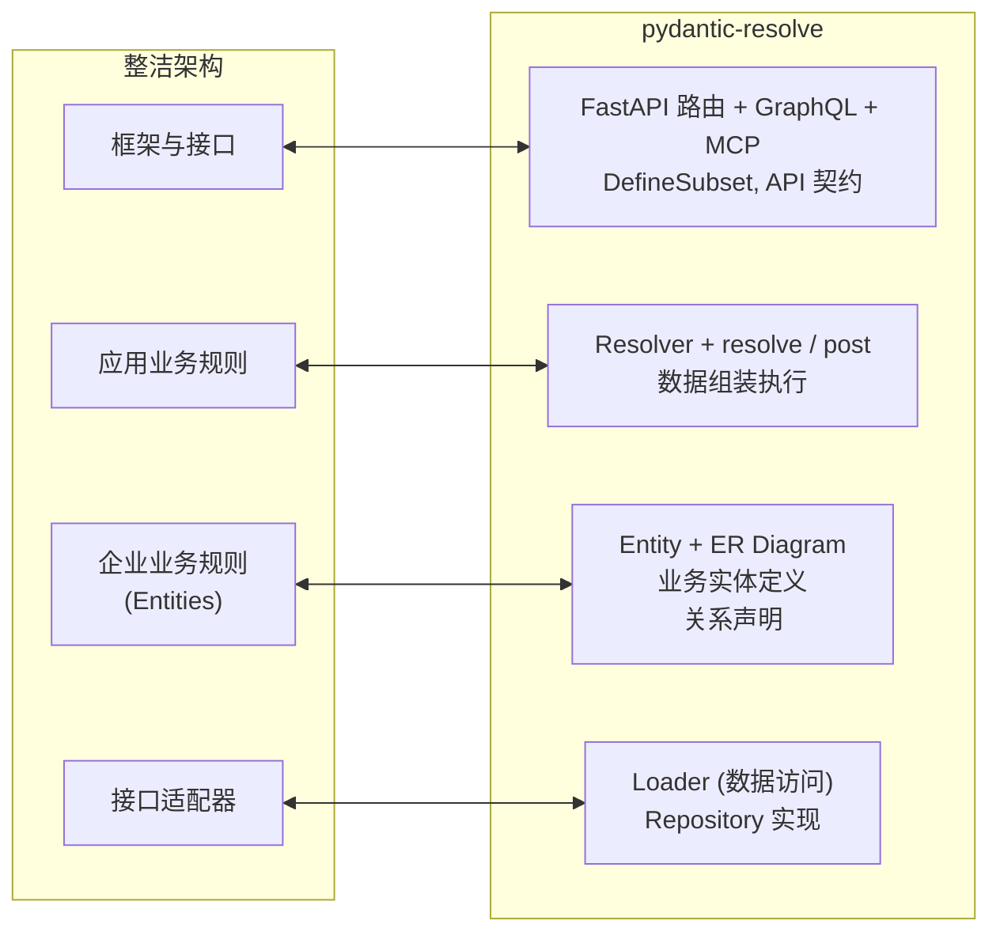

# Python 的整洁架构：Entity-First 实现

[English](./architecture_entity_first.md)

## 一、为什么整洁架构对 FastAPI 很重要

### 1.1 缺失的企业业务规则层

FastAPI 项目有一个惊人的结构相似性：先创建 SQLAlchemy ORM 模型，然后创建镜像它们的 Pydantic schema。这种"ORM-First"模式如此普遍，以至于许多开发者从未质疑过它。

根本问题是对两个抽象层次的混淆：数据库模型（ORM）和领域模型（Entity）。ORM 模型应该是数据持久化的实现细节，而不是架构的中心。Pydantic schema 不应该是 ORM 的影子，而是表达业务概念和 API 契约的独立抽象。

```python
# 数据组装的困境：这段逻辑该放在哪里？
@router.get("/tasks")
async def get_tasks():
    tasks = await task_service.get_tasks()

    # 收集 ID、批量查询、构建映射、组装结果...
    user_ids = list({t.owner_id for t in tasks})
    users = await user_service.get_users_by_ids(user_ids)
    user_map = {u.id: u for u in users}

    result = []
    for task in tasks:
        task_dict = task.model_dump()
        task_dict['owner'] = user_map.get(task.owner_id)
        result.append(TaskResponse(**task_dict))
    return result
```

无论这段代码放在 Repository、Service 还是 Route 中，问题都是一样的：**系统没有独立于数据库的企业业务规则层**。用整洁架构的术语来说，框架层（ORM）已经殖民了企业层。数据组装逻辑没有合适的位置。

### 1.2 缺失它的五个症状

| # | 症状 | 违反的整洁架构原则 |
|---|------|-------------------|
| 1 | Schema 被动跟随 ORM —— 同一字段定义两次 | API 契约（框架）绑定到数据库设计（适配器） |
| 2 | 业务概念丢失 —— 前端看到 `owner_id` 而不是"任务有负责人" | 企业业务规则被数据库结构渗透 |
| 3 | 数据组装无处安放 —— join 逻辑散落在 Repository / Service / Route | 应用业务规则层缺失 |
| 4 | 多数据源难以处理 —— 每新增一个数据源就要到处写转换代码 | 没有统一的接口适配器抽象 |
| 5 | Schema 复用困难 —— UserSummary / UserDetail / UserAvatar 靠复制粘贴 | 没有企业实体来衍生框架响应 |

这些不是个别工具问题。它们都是一个架构缺陷的后果：**缺少稳定的企业业务规则层**。

## 二、层次映射

### 2.1 整洁架构到 pydantic-resolve：1:1 对应关系

pydantic-resolve 提供了缺失的那一层。其组件与整洁架构直接对应：



依赖方向始终指向内层 —— 这是整洁架构的核心原则：

- **Entity** 不依赖任何框架或数据库。
- **Resolver** 依赖 Entity，但 Entity 不感知 Resolver。
- **Loader** 实现可以自由替换，不影响上层。
- **Response** 依赖 Entity，但 Entity 不感知 API 契约。

### 2.2 企业业务规则：Entity + ER Diagram

Entity 表达纯粹的业务概念 —— "用户"、"任务"、"项目" —— 独立于任何技术实现。当我们谈论业务时，我们说"这个任务属于一个用户"，而不是"tasks 表有一个 user_id 外键"。

```python
from pydantic import BaseModel
from pydantic_resolve import base_entity, Relationship

BaseEntity = base_entity()

class UserEntity(BaseModel):
    id: int
    name: str
    email: str

class TaskEntity(BaseModel, BaseEntity):
    """关系声明在实体上，而不是分散在各个端点中。"""
    __relationships__ = [
        Relationship(
            fk='owner_id',
            target=UserEntity,
            loader=user_loader  # 如何加载，不是存储在哪里
        )
    ]
    id: int
    name: str
    owner_id: int
```

关键点：
- Entity 是业务概念，不绑定任何实现。
- 关系通过 loader 连接，而不是数据库外键。
- 同一实体可以表达跨数据源的关系。

### 2.3 接口适配器：Loader

Loader 是整洁架构中的适配器。它将外部数据格式（ORM 对象、RPC 响应、缓存条目）转换为领域实体。Entity 只需要声明"我需要什么数据"，而不是"它从哪里来"。

```python
# 从数据库加载
async def user_loader(user_ids: list[int]):
    users = await UserORM.filter(UserORM.id.in_(user_ids))
    return build_object(users, user_ids, lambda u: u.id)

# 或从 RPC 加载
async def user_loader_from_rpc(user_ids: list[int]):
    users = await user_rpc.batch_get_users(user_ids)
    return build_object(users, user_ids, lambda u: u['id'])

# 或从 Redis 加载
async def user_loader_from_cache(user_ids: list[int]):
    users = await redis.mget(f"user:{uid}" for uid in user_ids)
    return build_object(users, user_ids, lambda u: u['id'])
```

当数据源迁移时，只需要修改 Loader。Entity 和 Response 保持不变。

### 2.4 应用业务规则：Resolver + resolve/post

整洁架构将应用业务规则定义为用例编排。在"获取任务列表"用例中，编排器需要协调 Task、User、Project 的数据加载。

传统三层架构没有这种编排的位置：

- **Repository** 应该只做数据访问。加入组装逻辑会使它膨胀成用例堆放场。
- **Service** 应该包含业务逻辑，而不是重复的批量查询和映射代码。
- **Route** 应该处理 HTTP 关注点，而不是数据组装。

Resolver 填补了这个空白。它通过两个机制自动化数据组装的通用模式：

- **`resolve_*`**：声明如何获取缺失数据（接口适配器交互）。
- **`post_*`**：在子树完全组装后计算派生字段。

```python
class SprintView(BaseModel):
    id: int
    name: str
    tasks: list[TaskView] = []
    task_count: int = 0
    contributor_names: list[str] = []

    def resolve_tasks(self, loader=Loader(task_loader)):
        return loader.load(self.id)

    def post_task_count(self):
        return len(self.tasks)

    def post_contributor_names(self):
        return sorted({task.owner.name for task in self.tasks if task.owner})
```

Resolver 遍历树：首先所有 `resolve_*` 方法加载缺失数据（自动批处理），然后所有 `post_*` 方法在组装好的树上计算派生值。

### 2.5 框架与接口：Response + FastAPI Routes

Response 派生自 Entity，而不是 ORM。它选择字段子集并添加用例特定的扩展：

```python
from pydantic_resolve import DefineSubset

# 场景 1：用户摘要（列表页）
class UserSummary(DefineSubset):
    __subset__ = (UserEntity, ('id', 'name'))

# 场景 2：任务列表（带负责人）
class TaskResponse(DefineSubset):
    __subset__ = (TaskEntity, ('id', 'name', 'estimate'))
    owner: Annotated[Optional[UserSummary], AutoLoad()] = None

# 场景 3：任务详情（更多字段）
class TaskDetailResponse(DefineSubset):
    __subset__ = (TaskEntity, ('id', 'name', 'estimate', 'created_at'))
    owner: Annotated[Optional[UserDetail], AutoLoad()] = None
```

Route 代码变得极简：

```python
@router.get("/tasks", response_model=list[TaskResponse])
async def get_tasks():
    tasks = await query_tasks_from_db()
    tasks = [TaskResponse.model_validate(t) for t in tasks]
    return await Resolver().resolve(tasks)
```

Route 不导入 SQLAlchemy 模块，不考虑加载策略，不写组装循环。它只声明业务语义："这个任务需要一个负责人"。

## 三、前后对比：实战比较

### 3.1 之前：ORM-First

```python
# models/task.py (ORM) — 企业层 + 适配器层混在一起
class TaskORM(Base):
    __tablename__ = 'tasks'
    id = Column(Integer, primary_key=True)
    name = Column(String(100))
    owner_id = Column(Integer, ForeignKey('users.id'))
    project_id = Column(Integer, ForeignKey('projects.id'))
    owner = relationship("UserORM", back_populates="tasks")
    project = relationship("ProjectORM", back_populates="tasks")

# schemas/task.py — 框架层是 ORM 的影子
class TaskResponse(BaseModel):
    id: int
    owner_id: int                    # DB 细节泄露到 API 契约
    project_id: int
    owner: Optional['UserResponse']
    project: Optional['ProjectResponse']

# routes/task.py — 应用层在 route 中，与 DB 关注点混合
@router.get("/tasks", response_model=list[TaskResponse])
async def get_tasks(session: AsyncSession = Depends(get_session)):
    result = await session.execute(
        select(TaskORM).options(
            selectinload(TaskORM.owner),
            selectinload(TaskORM.project)
        )
    )
    tasks = result.scalars().all()
    return [TaskResponse.model_validate(t) for t in tasks]
```

注意 Route 导入了什么：`selectinload`、`AsyncSession`、ORM 模型。框架层知道了数据库。

### 3.2 之后：Entity-First 与整洁架构层次

```python
# entities/task.py — 企业业务规则层
class TaskEntity(BaseModel, BaseEntity):
    __relationships__ = [
        Relationship(fk='owner_id', target=UserEntity, name='owner', loader=user_loader),
        Relationship(fk='project_id', target=ProjectEntity, name='project', loader=project_loader),
    ]
    id: int
    name: str
    owner_id: int
    project_id: int

# responses/task.py — 框架与接口层
class TaskResponse(DefineSubset):
    __subset__ = (TaskEntity, ('id', 'name'))
    owner: Annotated[Optional[UserResponse], AutoLoad()] = None
    project: Annotated[Optional[ProjectSummary], AutoLoad()] = None

# routes/task.py — 框架层，没有 DB 导入
@router.get("/tasks", response_model=list[TaskResponse])
async def get_tasks():
    tasks_orm = await query_tasks_from_db()
    tasks = [TaskResponse.model_validate(t) for t in tasks_orm]
    return await Resolver().resolve(tasks)
```

### 3.3 逐层变化

| 维度 | 之前（ORM-First） | 之后（Entity-First） |
|------|-------------------|---------------------|
| **企业层** | 无实体层；ORM 就是领域 | Entity + ERD 作为稳定核心 |
| **应用层** | 组装逻辑散落在 routes/services | Resolver 自动化编排 |
| **适配器层** | ORM `relationship` + `selectinload` | Loader 统一接口 |
| **框架层** | Schema 镜像 ORM；route 导入 DB 模块 | Response 派生自 Entity；route 与 DB 无关 |

## 四、架构原则

### 依赖倒置原则

整洁架构的核心原则是"依赖方向指向内层"：

- Entity 不依赖任何框架或数据库 —— 它是最内层的稳定核心。
- API 层依赖 Entity，但 Entity 不感知 API 的存在。
- Loader 实现可以自由替换 —— 上层代码不受影响。

简而言之：Entity 不知道 Loader。Loader 不知道 FastAPI。FastAPI 不知道数据库。

### 关注点分离

- **Entity** 表达"是什么" —— 用户有哪些属性，任务有负责人。
- **Loader** 解决"怎么做" —— 数据从哪里来，如何批量查询。
- **Response** 定义"暴露什么" —— API 为特定用例返回什么字段。

### 可测试性

由于 Loader 是统一的数据访问接口，测试可以轻松 mock 它。测试用例专注于验证业务逻辑，无需启动数据库或管理事务状态。

### 演进能力

| 演进场景 | 整洁架构的应对 | Entity-First 实现 |
|---------|---------------|------------------|
| 数据库迁移 | 只修改适配器 | 只修改 Loader |
| API 升级 | 只修改接口/展示器 | 只修改 Response |
| 业务扩展 | 扩展实体和用例 | 扩展 Entity 和 ERD |
| 多数据源 | 添加新适配器 | 添加新 Loader |

## 五、迁移指南

### 步骤 1：提取 Entity

```python
# 从现有 ORM 模型中提取业务概念
class UserEntity(BaseModel):
    id: int
    name: str
    email: str
    # 移除：password_hash, created_at, updated_at
```

### 步骤 2：定义 ERD

```python
class TaskEntity(BaseModel, BaseEntity):
    __relationships__ = [
        Relationship(fk='owner_id', target=UserEntity, name='owner', loader=user_loader),
    ]
```

### 步骤 3：重构 Response

```python
class TaskResponse(DefineSubset):
    __subset__ = (TaskEntity, ('id', 'name'))
    owner: Annotated[Optional[UserSummary], AutoLoad()] = None
```

### 步骤 4：渐进式替换

- 保留现有 ORM。
- 新功能使用 Entity-First。
- 旧接口逐步重构。

### 注意事项

- 不要一次性重构所有代码。
- ORM 和 Entity 可以共存。
- 在新功能中优先使用 Entity-First。

## 六、常见问题

### Q1：Entity 不就是 ORM 的复制吗？

不是。Entity 和 ORM 有根本区别：

- Entity 是业务概念；ORM 是数据库映射。
- Entity 可以表达数据库无法表达的关系（跨数据源）。
- Entity 是稳定核心；ORM 是可替换实现。

### Q2：这不会增加代码量吗？

初期可能增加，但长期收益更大：

- DefineSubset 消除了 ORM 和 Schema 之间的重复代码。
- Loader 可以在端点间复用。

### Q3：小项目需要这个吗？

取决于项目复杂度：

- 简单 CRUD：ORM-First 足够。
- 复杂业务逻辑或多数据源：推荐 Entity-First。
- 团队协作：Entity-First 更易维护。

### Q4：如何处理写操作（POST/PUT/PATCH）？

写操作与读操作不同：

- 写：可以继续使用 ORM 或 Pydantic schema 作为 DTO。
- 读：使用 Entity-First 获得架构优势。

## 七、SQLModel 呢？

SQLModel 是一个实用工具，它在 ORM-First 框架内优化开发体验，但不解决根本的架构问题。

**SQLModel 解决了什么**：类型定义重复和字段同步 —— 一个类同时作为 DB 模型和 Pydantic schema。

**SQLModel 无法解决**：

- Schema 仍然被动跟随 ORM —— 没有独立的业务实体层。
- 没有统一的多数据源处理 —— SQLModel 只处理 SQLAlchemy 连接的数据源。
- 数据组装困境仍然存在 —— 开发者仍需手写批量查询和映射代码。
- 没有 schema 复用机制 —— 无法从模型派生子集字段。

**定位**：SQLModel 是"更好的 ORM-First 解决方案"，而不是 Entity-First 解决方案。它适合单数据源的简单 CRUD 项目。对于复杂业务逻辑、稳定的 API 契约或多数据源集成，使用 pydantic-resolve 的 Entity-First 是更可持续的选择。
