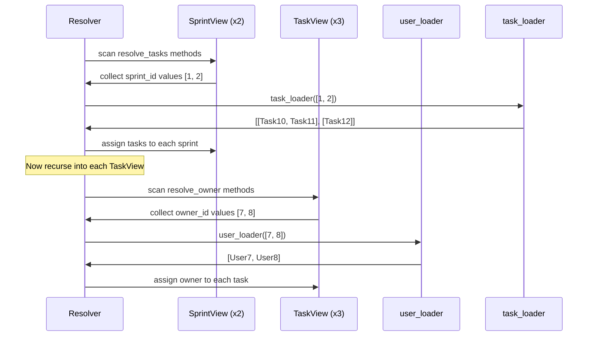

# Core API

[中文版](./core_api.zh.md)

The quick start loaded one field from outside the current node. This page extends the same idea into a nested response tree.

No ERD yet. No `AutoLoad` yet. Just `resolve_*` methods, batched loaders, and recursive traversal.

## Goal

You want a sprint response where:

- `Sprint` has many `tasks`
- each `Task` has one `owner`

```json
{
    "id": 1,
    "name": "Sprint 24",
    "tasks": [
        {
            "id": 10,
            "title": "Design docs",
            "owner_id": 7,
            "owner": {"id": 7, "name": "Ada"}
        },
        {
            "id": 11,
            "title": "Refine examples",
            "owner_id": 8,
            "owner": {"id": 8, "name": "Bob"}
        }
    ]
}
```

## Step 1: Add the One-to-Many Loader

The `TaskView` and `user_loader` are the same as the quick start. The new piece is `SprintView` with `resolve_tasks`, and a loader that uses `build_list` instead of `build_object`:

```python
from pydantic_resolve import build_list


async def task_loader(sprint_ids: list[int]):  # (1)
    tasks = [t for t in TASKS if t["sprint_id"] in sprint_ids]
    return build_list(tasks, sprint_ids, lambda t: t["sprint_id"])


class SprintView(BaseModel):
    id: int
    name: str
    tasks: list[TaskView] = []

    def resolve_tasks(self, loader=Loader(task_loader)):  # (2)
        return loader.load(self.id)
```

1.  `task_loader` receives a batch of sprint IDs and returns a list of tasks **per sprint**.
2.  `resolve_tasks` follows the same pattern as `resolve_owner` — the only difference is the loader returns a list instead of a single object.

## Step 2: Run the Resolver

Wire it together — the same `Resolver().resolve()` call handles the full tree:

```python
raw_sprints = [
    {"id": 1, "name": "Sprint 24"},
    {"id": 2, "name": "Sprint 25"},
]

sprints = [SprintView.model_validate(s) for s in raw_sprints]
sprints = await Resolver().resolve(sprints)

for s in sprints:
    print(s.model_dump())
```

Output:

```python
{
    'id': 1, 'name': 'Sprint 24',
    'tasks': [
        {'id': 10, 'title': 'Design docs', 'owner_id': 7, 'owner': {'id': 7, 'name': 'Ada'}},
        {'id': 11, 'title': 'Refine examples', 'owner_id': 8, 'owner': {'id': 8, 'name': 'Bob'}},
    ]
}
{
    'id': 2, 'name': 'Sprint 25',
    'tasks': [
        {'id': 12, 'title': 'Write tests', 'owner_id': 7, 'owner': {'id': 7, 'name': 'Ada'}},
    ]
}
```

**Result:** one query per loader, regardless of how many sprints or tasks you load.

## How the Resolver Traverses the Tree

You do not write any traversal code. The resolver walks the tree automatically:



1.  At each tree level, scan all `resolve_*` methods and collect requested keys.
2.  Call each loader **once** with the full batch of deduplicated keys.
3.  Assign results, then **recurse** into child nodes.

Adding a new nested relationship means adding one `resolve_*` method and one loader — the traversal logic stays the same.

## build_list vs build_object

| Function | Use when | Returns |
|----------|----------|---------|
| `build_object(items, keys, get_key)` | One-to-one | `list[item \| None]` — one element per key |
| `build_list(items, keys, get_key)` | One-to-many | `list[list[item]]` — a list of items per key |

```python
# One-to-one: one user per id
async def user_loader(user_ids: list[int]):
    users = [USERS.get(uid) for uid in user_ids]
    return build_object(users, user_ids, lambda u: u.id)
# Result: [User7, User8, None, User9, ...]

# One-to-many: many tasks per sprint
async def task_loader(sprint_ids: list[int]):
    tasks = [t for t in TASKS if t["sprint_id"] in sprint_ids]
    return build_list(tasks, sprint_ids, lambda t: t["sprint_id"])
# Result: [[Task10, Task11], [Task12], []]
```

## Resolver Options

### context

Pass a global context dict accessible in all `resolve_*` and `post_*` methods:

```python
tasks = await Resolver(context={'tenant_id': 1}).resolve(tasks)
```

```python
def resolve_owner(self, loader=Loader(user_loader), context=None):
    tenant = context.get('tenant_id')
    return loader.load(self.owner_id)
```

### loader_params

Provide parameters to specific DataLoader classes:

```python
class OfficeLoader(DataLoader):
    status: str  # no default, must be provided

    async def batch_load_fn(self, company_ids):
        offices = await get_offices(company_ids, self.status)
        return build_list(offices, company_ids, lambda o: o.company_id)

companies = await Resolver(
    loader_params={OfficeLoader: {'status': 'open'}}
).resolve(companies)
```

### global_loader_param

Set parameters for all loaders at once. Overlapping with `loader_params` raises an error:

```python
# This raises an error — 'status' is set in both places
companies = await Resolver(
    global_loader_param={'status': 'open'},
    loader_params={OfficeLoader: {'status': 'closed'}}
).resolve(companies)
```

### loader_instances

Pre-create and prime a DataLoader with known data:

```python
loader = UserLoader()
loader.prime(7, UserView(id=7, name="Ada"))

tasks = await Resolver(
    loader_instances={UserLoader: loader}
).resolve(tasks)
```

### debug

Print per-node timing information:

```python
tasks = await Resolver(debug=True).resolve(tasks)
# TaskView       : avg: 0.4ms, max: 0.5ms, min: 0.4ms
# SprintView     : avg: 1.1ms, max: 1.1ms, min: 1.1ms
```

Or enable globally: `export PYDANTIC_RESOLVE_DEBUG=true`

## Multiple Loaders in One Method

```python
async def resolve_tasks(
    self,
    task_loader=Loader(task_loader_fn),
    meta_loader=Loader(meta_loader_fn)
):
    tasks = await task_loader.load(self.id)
    self.metadata = await meta_loader.load(self.id)
    return tasks
```

## Common Patterns

Load and filter:

```python
async def resolve_active_tasks(self, loader=Loader(task_loader)):
    tasks = await loader.load(self.id)
    return [t for t in tasks if t.status == 'active']
```

Conditional loading:

```python
def resolve_thumbnail(self, loader=Loader(image_loader)):
    if self.thumbnail_id:
        return loader.load(self.thumbnail_id)
    return None
```

Derived value without a loader:

```python
def resolve_display_name(self):
    return f"{self.first_name} {self.last_name}"
```

When `resolve_*` does not declare a loader, it returns a computed value directly — no external IO needed.

## When to Stay with Core API

Manual `resolve_*` is the right tool when:

- you only have a few response models
- relationship wiring is not repeating yet
- you want each endpoint to stay maximally explicit
- the response shape is still changing quickly

## Next

- [Post Processing](./post_processing.md) — compute derived fields after all data is loaded.
- [Cross-Layer Data Flow](./cross_layer_data_flow.md) — share data between parent and child nodes.
