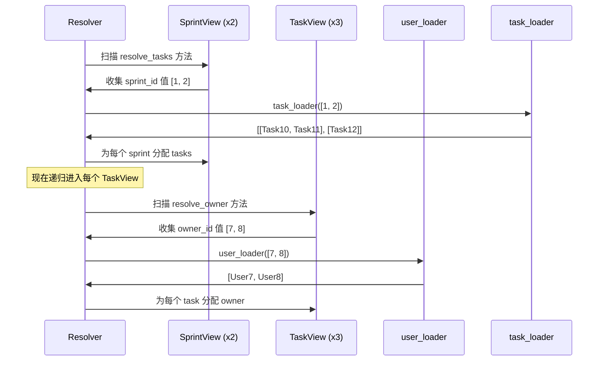

# 核心 API

[English](./core_api.md)

快速开始从当前节点之外加载了一个字段。本页将同样的模式扩展到嵌套响应树。

还没有 ERD，还没有 `AutoLoad`。只有 `resolve_*` 方法、批处理 loader 和递归遍历。

## 目标

你想要一个 sprint 响应，其中：

- `Sprint` 有多个 `tasks`
- 每个 `Task` 有一个 `owner`

```json
{
    "id": 1,
    "name": "Sprint 24",
    "tasks": [
        {
            "id": 10,
            "title": "Design docs",
            "owner_id": 7,
            "owner": {"id": 7, "name": "Ada"}
        },
        {
            "id": 11,
            "title": "Refine examples",
            "owner_id": 8,
            "owner": {"id": 8, "name": "Bob"}
        }
    ]
}
```

## Step 1：添加一对多 Loader

`TaskView` 和 `user_loader` 与快速开始中相同。新增的是 `SprintView` 及其 `resolve_tasks`，以及一个使用 `build_list`（而非 `build_object`）的 loader：

```python
from pydantic_resolve import build_list


async def task_loader(sprint_ids: list[int]):  # (1)
    tasks = [t for t in TASKS if t["sprint_id"] in sprint_ids]
    return build_list(tasks, sprint_ids, lambda t: t["sprint_id"])


class SprintView(BaseModel):
    id: int
    name: str
    tasks: list[TaskView] = []

    def resolve_tasks(self, loader=Loader(task_loader)):  # (2)
        return loader.load(self.id)
```

1.  `task_loader` 接收一批 sprint ID，并返回**每个 sprint** 的 task 列表。
2.  `resolve_tasks` 遵循与 `resolve_owner` 相同的模式 —— 唯一的区别是 loader 返回列表而非单个对象。

## Step 2：运行解析器

将它们组合起来 —— 同样的 `Resolver().resolve()` 调用处理整棵树：

```python
raw_sprints = [
    {"id": 1, "name": "Sprint 24"},
    {"id": 2, "name": "Sprint 25"},
]

sprints = [SprintView.model_validate(s) for s in raw_sprints]
sprints = await Resolver().resolve(sprints)

for s in sprints:
    print(s.model_dump())
```

输出：

```python
{
    'id': 1, 'name': 'Sprint 24',
    'tasks': [
        {'id': 10, 'title': 'Design docs', 'owner_id': 7, 'owner': {'id': 7, 'name': 'Ada'}},
        {'id': 11, 'title': 'Refine examples', 'owner_id': 8, 'owner': {'id': 8, 'name': 'Bob'}},
    ]
}
{
    'id': 2, 'name': 'Sprint 25',
    'tasks': [
        {'id': 12, 'title': 'Write tests', 'owner_id': 7, 'owner': {'id': 7, 'name': 'Ada'}},
    ]
}
```

**结果：** 每个 loader 一次查询，无论你加载多少个 sprint 或 task。

## 解析器如何遍历树

你不需要编写任何遍历代码。解析器自动遍历整棵树：



1.  在树的每一层，扫描所有 `resolve_*` 方法并收集请求的 key。
2.  用去重后的完整批量 **一次性**调用每个 loader。
3.  分配结果，然后**递归**进入子节点。

添加新的嵌套关系只需添加一个 `resolve_*` 方法和一个 loader —— 遍历逻辑不变。

## build_list vs build_object

| 函数 | 使用时机 | 返回 |
|----------|----------|---------|
| `build_object(items, keys, get_key)` | 一对一 | `list[item \| None]` —— 每个 key 一个元素 |
| `build_list(items, keys, get_key)` | 一对多 | `list[list[item]]` —— 每个 key 一个列表 |

```python
# 一对一：每个 id 一个 user
async def user_loader(user_ids: list[int]):
    users = [USERS.get(uid) for uid in user_ids]
    return build_object(users, user_ids, lambda u: u.id)
# 结果：[User7, User8, None, User9, ...]

# 一对多：每个 sprint 多个 task
async def task_loader(sprint_ids: list[int]):
    tasks = [t for t in TASKS if t["sprint_id"] in sprint_ids]
    return build_list(tasks, sprint_ids, lambda t: t["sprint_id"])
# 结果：[[Task10, Task11], [Task12], []]
```

## Resolver 配置

### context

传递一个全局上下文字典，可在所有 `resolve_*` 和 `post_*` 方法中访问：

```python
tasks = await Resolver(context={'tenant_id': 1}).resolve(tasks)
```

```python
def resolve_owner(self, loader=Loader(user_loader), context=None):
    tenant = context.get('tenant_id')
    return loader.load(self.owner_id)
```

### loader_params

为特定的 DataLoader 类提供参数：

```python
class OfficeLoader(DataLoader):
    status: str  # 没有默认值，必须提供

    async def batch_load_fn(self, company_ids):
        offices = await get_offices(company_ids, self.status)
        return build_list(offices, company_ids, lambda o: o.company_id)

companies = await Resolver(
    loader_params={OfficeLoader: {'status': 'open'}}
).resolve(companies)
```

### global_loader_param

一次为所有 loader 设置参数。与 `loader_params` 重叠会抛出错误：

```python
# 这会抛出错误 —— 'status' 在两处都设置了
companies = await Resolver(
    global_loader_param={'status': 'open'},
    loader_params={OfficeLoader: {'status': 'closed'}}
).resolve(companies)
```

### loader_instances

预创建 DataLoader 并用已知数据填充：

```python
loader = UserLoader()
loader.prime(7, UserView(id=7, name="Ada"))

tasks = await Resolver(
    loader_instances={UserLoader: loader}
).resolve(tasks)
```

### debug

打印每个节点的计时信息：

```python
tasks = await Resolver(debug=True).resolve(tasks)
# TaskView       : avg: 0.4ms, max: 0.5ms, min: 0.4ms
# SprintView     : avg: 1.1ms, max: 1.1ms, min: 1.1ms
```

或全局启用：`export PYDANTIC_RESOLVE_DEBUG=true`

## 一个方法中的多个 Loader

```python
async def resolve_tasks(
    self,
    task_loader=Loader(task_loader_fn),
    meta_loader=Loader(meta_loader_fn)
):
    tasks = await task_loader.load(self.id)
    self.metadata = await meta_loader.load(self.id)
    return tasks
```

## 常见模式

加载并过滤：

```python
async def resolve_active_tasks(self, loader=Loader(task_loader)):
    tasks = await loader.load(self.id)
    return [t for t in tasks if t.status == 'active']
```

条件加载：

```python
def resolve_thumbnail(self, loader=Loader(image_loader)):
    if self.thumbnail_id:
        return loader.load(self.thumbnail_id)
    return None
```

无 loader 的派生值：

```python
def resolve_display_name(self):
    return f"{self.first_name} {self.last_name}"
```

当 `resolve_*` 不声明 loader 时，它直接返回计算值 —— 无需外部 IO。

## 何时停留在 Core API

手写 `resolve_*` 在以下场景是正确的选择：

- 你只有少数几个响应模型
- 关系连线还没有重复出现
- 你希望每个接口保持最大程度的显式性
- 响应结构仍在快速变化

## 下一步

- [后处理](./post_processing.zh.md) —— 在所有数据加载完成后计算派生字段。
- [跨层数据流](./cross_layer_data_flow.zh.md) —— 在父子节点之间共享数据。
