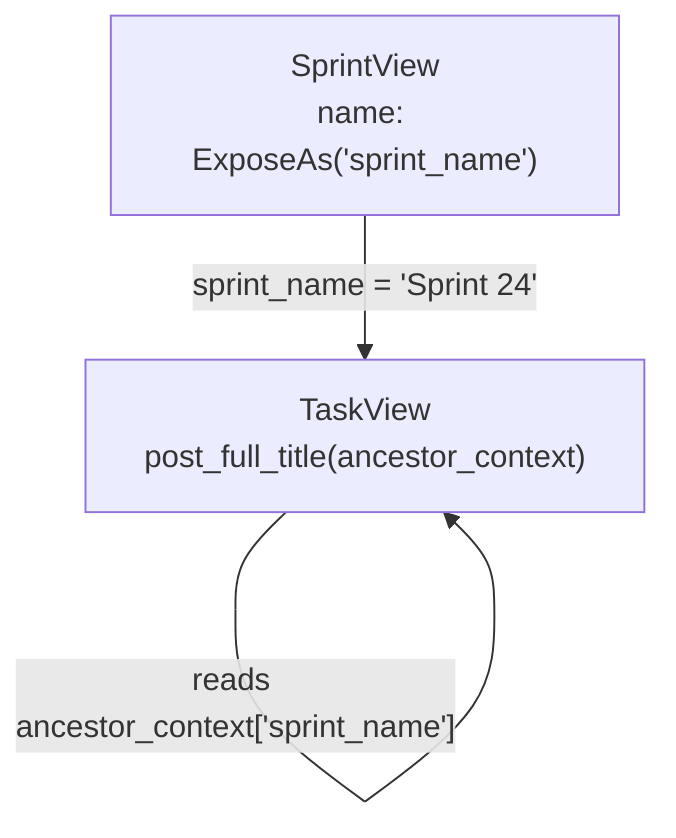
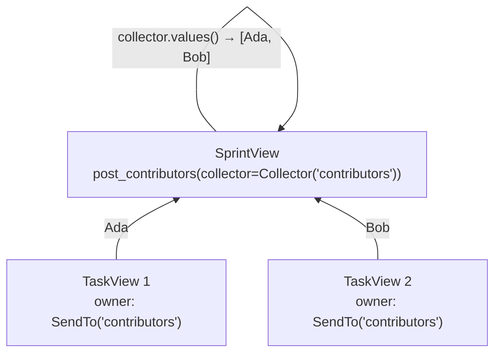
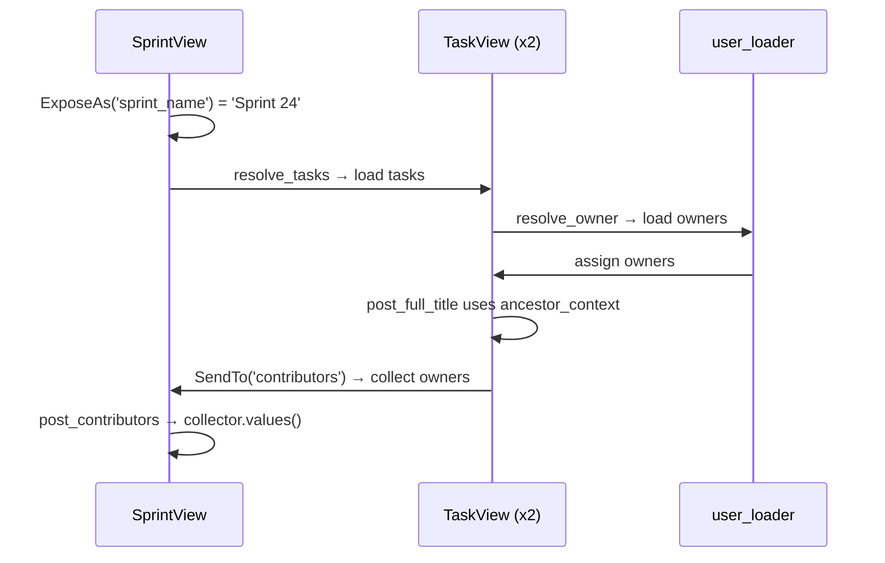

# Cross-Layer Data Flow

[中文版](./cross_layer_data_flow.zh.md)

`resolve_*` loads data, `post_*` computes derived fields. But what if a child needs ancestor context, or a parent needs to aggregate descendant values? That is where `ExposeAs`, `SendTo`, and `Collector` come in.

## Goal

Still on the `Sprint -> Task -> User` scenario. You now want:

1. Each task to build a `full_title` like `Sprint 24 / Design docs`.
2. Each sprint to aggregate all task owners into `contributors`.

```json
[
    {
        "id": 1,
        "name": "Sprint 24",
        "tasks": [
            {"id": 10, "title": "Design docs", "full_title": "Sprint 24 / Design docs",
             "owner": {"id": 7, "name": "Ada"}},
            {"id": 11, "title": "Refine examples", "full_title": "Sprint 24 / Refine examples",
             "owner": {"id": 8, "name": "Bob"}}
        ],
        "contributors": [{"id": 7, "name": "Ada"}, {"id": 8, "name": "Bob"}]
    },
    {
        "id": 2,
        "name": "Sprint 25",
        "tasks": [
            {"id": 12, "title": "Bug fixes", "full_title": "Sprint 25 / Bug fixes",
             "owner": {"id": 7, "name": "Ada"}}
        ],
        "contributors": [{"id": 7, "name": "Ada"}]
    }
]
```

Both problems cross object boundaries — child needs parent data, parent needs child data.

## Step 1: Send Ancestor Data Down with ExposeAs

`ExposeAs('sprint_name')` publishes `SprintView.name` to all descendants under the alias `sprint_name`:

```python
from typing import Annotated
from pydantic_resolve import ExposeAs


class SprintView(BaseModel):
    id: int
    name: Annotated[str, ExposeAs('sprint_name')]  # (1)
    tasks: list[TaskView] = []
    contributors: list[UserView] = []

    def resolve_tasks(self, loader=Loader(task_loader)):
        return loader.load(self.id)

    def post_contributors(self, collector=Collector('contributors')):
        return collector.values()
```

1.  Descendants can read this value via `ancestor_context['sprint_name']`.



## Step 2: Send Child Data Up with SendTo and Collector

`SendTo('contributors')` marks `TaskView.owner` as data that flows upward. `Collector('contributors')` receives it on the parent:

```python
class TaskView(BaseModel):
    id: int
    title: str
    owner_id: int
    owner: Annotated[Optional[UserView], SendTo('contributors')] = None  # (1)
    full_title: str = ""

    def resolve_owner(self, loader=Loader(user_loader)):
        return loader.load(self.owner_id)

    def post_full_title(self, ancestor_context):  # (2)
        return f"{ancestor_context['sprint_name']} / {self.title}"
```

1.  After this field is resolved, its value is sent to the parent's `contributors` collector.
2.  `ancestor_context` contains all `ExposeAs` values from ancestors.



## Step 3: Run the Resolver

```python
raw_sprints = [
    {"id": 1, "name": "Sprint 24"},
    {"id": 2, "name": "Sprint 25"},
]
sprints = [SprintView.model_validate(s) for s in raw_sprints]
sprints = await Resolver().resolve(sprints)

for s in sprints:
    print(s.model_dump())
```

Output:

```python
{'id': 1, 'name': 'Sprint 24',
 'tasks': [
     {'id': 10, 'title': 'Design docs', 'owner_id': 7,
      'owner': {'id': 7, 'name': 'Ada'},
      'full_title': 'Sprint 24 / Design docs'},
     {'id': 11, 'title': 'Refine examples', 'owner_id': 8,
      'owner': {'id': 8, 'name': 'Bob'},
      'full_title': 'Sprint 24 / Refine examples'},
 ],
 'contributors': [{'id': 7, 'name': 'Ada'}, {'id': 8, 'name': 'Bob'}]}
{'id': 2, 'name': 'Sprint 25',
 'tasks': [
     {'id': 12, 'title': 'Bug fixes', 'owner_id': 7,
      'owner': {'id': 7, 'name': 'Ada'},
      'full_title': 'Sprint 25 / Bug fixes'},
 ],
 'contributors': [{'id': 7, 'name': 'Ada'}]}
```

## Lifecycle



1.  Ancestor data is exposed downward (`ExposeAs`).
2.  Descendants resolve and post-process themselves (`resolve_*` + `post_*`).
3.  Descendant values are sent upward (`SendTo`).
4.  Parent `post_*` consumes collected values (`Collector`).

No manual tree traversal code is needed.

## Advanced Usage

### Multiple Levels of Exposure

`ExposeAs` works across any depth. A grandparent's value reaches all descendants:

```python
class OrganizationView(BaseModel):
    org_name: Annotated[str, ExposeAs('org_name')]
    projects: list[ProjectView] = []

class ProjectView(BaseModel):
    project_name: Annotated[str, ExposeAs('project_name')]
    sprints: list[SprintView] = []

class SprintView(BaseModel):
    name: str
    context_info: str = ""

    def post_context_info(self, ancestor_context):
        org = ancestor_context.get('org_name', '')
        proj = ancestor_context.get('project_name', '')
        return f"{org} > {proj} > {self.name}"
```

### Collector with flat=True

By default `Collector` uses `append`. With `flat=True` it uses `extend` to merge lists:

```python
class SprintView(BaseModel):
    tasks: list[TaskView] = []
    all_tags: list[str] = []

    def resolve_tasks(self, loader=Loader(task_loader)):
        return loader.load(self.id)

    def post_all_tags(self, collector=Collector('task_tags', flat=True)):
        return collector.values()


class TaskView(BaseModel):
    tags: Annotated[list[str], SendTo('task_tags')] = []
```

Without `flat=True`: `[['design', 'docs'], ['examples']]`. With `flat=True`: `['design', 'docs', 'examples']`.

### SendTo with Tuple Targets

A single field can send to multiple collectors:

```python
owner: Annotated[
    Optional[UserView],
    SendTo(('contributors', 'all_users'))
] = None
```

### Custom Collector with ICollector

Implement your own collector by subclassing `ICollector`:

```python
from pydantic_resolve import ICollector

class CounterCollector(ICollector):
    def __init__(self, alias):
        self.alias = alias
        self.counter = 0

    def add(self, val):
        self.counter += len(val)

    def values(self):
        return self.counter
```

### Combining with AutoLoad

You can combine `AutoLoad`, `SendTo`, and `ExposeAs` on the same field:

```python
class TaskView(TaskEntity):
    owner: Annotated[
        Optional[UserEntity],
        AutoLoad(),                # auto-resolve via ERD
        SendTo('contributors')     # send to parent's collector
    ] = None
```

## Practical Rules

Alias names should be unique within the resolved tree:

```python
# GOOD: unique aliases
class Project(BaseModel):
    name: Annotated[str, ExposeAs('project_name')]

class Sprint(BaseModel):
    name: Annotated[str, ExposeAs('sprint_name')]

# BAD: conflicting aliases
class Project(BaseModel):
    name: Annotated[str, ExposeAs('name')]  # ambiguous

class Sprint(BaseModel):
    name: Annotated[str, ExposeAs('name')]  # collides with Project
```

## When to Use Cross-Layer Flow

Reach for it when:

- Children need ancestor context and passing it explicitly would clutter signatures
- Parents need aggregated descendant data and manual loops would spread across code
- The same ancestor data is needed at many nesting levels

Skip it when:

- A field can be computed locally inside the current node
- Only one layer is involved
- The explicit version is still short and obvious

## Next

Continue to [ERD and AutoLoad](./erd_and_autoload.md) when repeated `resolve_*` wiring starts to appear across many models.
