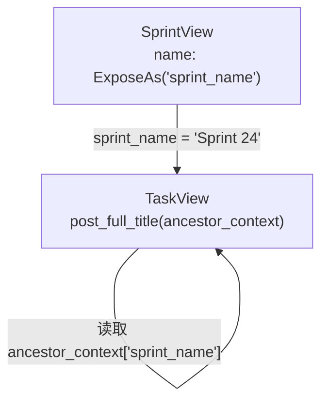
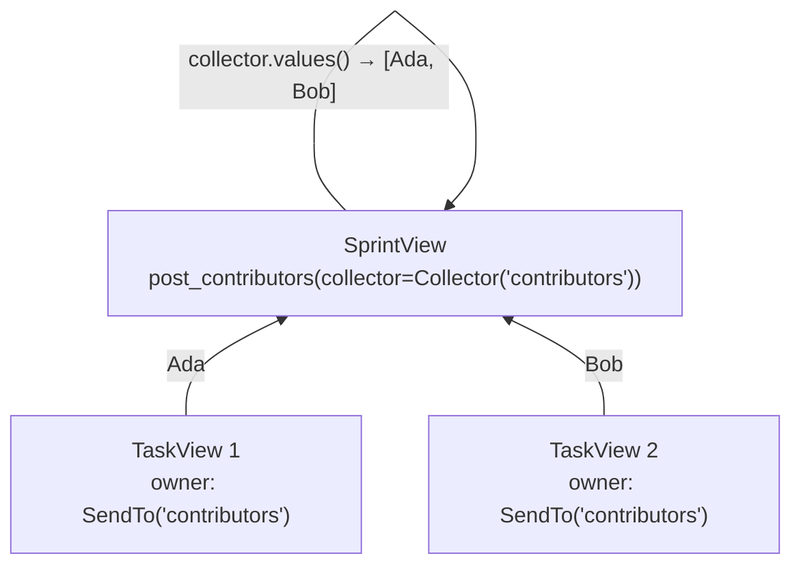
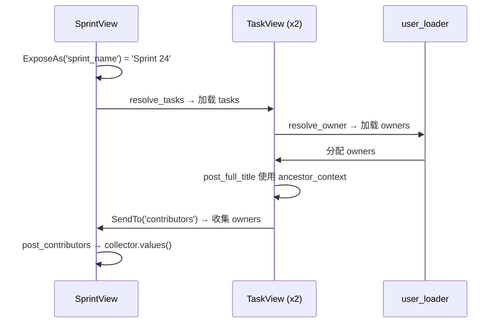

# 跨层数据流

[English](./cross_layer_data_flow.md)

`resolve_*` 加载数据，`post_*` 计算派生字段。但如果子节点需要祖先上下文，或父节点需要聚合后代值呢？`ExposeAs`、`SendTo` 和 `Collector` 就是为此而生。

## 目标

继续使用 `Sprint -> Task -> User` 场景。你现在需要：

1. 每个 task 构建一个 `full_title`，如 `Sprint 24 / Design docs`。
2. 每个 sprint 将所有 task owner 聚合到 `contributors` 中。

```json
[
    {
        "id": 1,
        "name": "Sprint 24",
        "tasks": [
            {"id": 10, "title": "Design docs", "full_title": "Sprint 24 / Design docs",
             "owner": {"id": 7, "name": "Ada"}},
            {"id": 11, "title": "Refine examples", "full_title": "Sprint 24 / Refine examples",
             "owner": {"id": 8, "name": "Bob"}}
        ],
        "contributors": [{"id": 7, "name": "Ada"}, {"id": 8, "name": "Bob"}]
    },
    {
        "id": 2,
        "name": "Sprint 25",
        "tasks": [
            {"id": 12, "title": "Bug fixes", "full_title": "Sprint 25 / Bug fixes",
             "owner": {"id": 7, "name": "Ada"}}
        ],
        "contributors": [{"id": 7, "name": "Ada"}]
    }
]
```

两个问题都跨越对象边界 —— 子节点需要父节点数据，父节点需要子节点数据。

## Step 1：用 ExposeAs 向下传递祖先数据

`ExposeAs('sprint_name')` 将 `SprintView.name` 以别名 `sprint_name` 发布给所有后代：

```python
from typing import Annotated
from pydantic_resolve import ExposeAs


class SprintView(BaseModel):
    id: int
    name: Annotated[str, ExposeAs('sprint_name')]  # (1)
    tasks: list[TaskView] = []
    contributors: list[UserView] = []

    def resolve_tasks(self, loader=Loader(task_loader)):
        return loader.load(self.id)

    def post_contributors(self, collector=Collector('contributors')):
        return collector.values()
```

1.  后代可以通过 `ancestor_context['sprint_name']` 读取这个值。



## Step 2：用 SendTo 和 Collector 向上汇总子节点数据

`SendTo('contributors')` 将 `TaskView.owner` 标记为向上流动的数据。`Collector('contributors')` 在父节点上接收它：

```python
class TaskView(BaseModel):
    id: int
    title: str
    owner_id: int
    owner: Annotated[Optional[UserView], SendTo('contributors')] = None  # (1)
    full_title: str = ""

    def resolve_owner(self, loader=Loader(user_loader)):
        return loader.load(self.owner_id)

    def post_full_title(self, ancestor_context):  # (2)
        return f"{ancestor_context['sprint_name']} / {self.title}"
```

1.  该字段解析后，其值会被发送到父节点的 `contributors` 收集器。
2.  `ancestor_context` 包含所有祖先的 `ExposeAs` 值。



## Step 3：运行解析器

```python
raw_sprints = [
    {"id": 1, "name": "Sprint 24"},
    {"id": 2, "name": "Sprint 25"},
]
sprints = [SprintView.model_validate(s) for s in raw_sprints]
sprints = await Resolver().resolve(sprints)

for s in sprints:
    print(s.model_dump())
```

输出：

```python
{'id': 1, 'name': 'Sprint 24',
 'tasks': [
     {'id': 10, 'title': 'Design docs', 'owner_id': 7,
      'owner': {'id': 7, 'name': 'Ada'},
      'full_title': 'Sprint 24 / Design docs'},
     {'id': 11, 'title': 'Refine examples', 'owner_id': 8,
      'owner': {'id': 8, 'name': 'Bob'},
      'full_title': 'Sprint 24 / Refine examples'},
 ],
 'contributors': [{'id': 7, 'name': 'Ada'}, {'id': 8, 'name': 'Bob'}]}
{'id': 2, 'name': 'Sprint 25',
 'tasks': [
     {'id': 12, 'title': 'Bug fixes', 'owner_id': 7,
      'owner': {'id': 7, 'name': 'Ada'},
      'full_title': 'Sprint 25 / Bug fixes'},
 ],
 'contributors': [{'id': 7, 'name': 'Ada'}]}
```

## 生命周期



1.  祖先数据向下暴露（`ExposeAs`）。
2.  后代解析和后处理自己（`resolve_*` + `post_*`）。
3.  后代值向上发送（`SendTo`）。
4.  父 `post_*` 消费收集的值（`Collector`）。

不需要编写手动树遍历代码。

## 进阶用法

### 多级暴露

`ExposeAs` 跨任意深度工作。祖父的暴露值能到达所有后代：

```python
class OrganizationView(BaseModel):
    org_name: Annotated[str, ExposeAs('org_name')]
    projects: list[ProjectView] = []

class ProjectView(BaseModel):
    project_name: Annotated[str, ExposeAs('project_name')]
    sprints: list[SprintView] = []

class SprintView(BaseModel):
    name: str
    context_info: str = ""

    def post_context_info(self, ancestor_context):
        org = ancestor_context.get('org_name', '')
        proj = ancestor_context.get('project_name', '')
        return f"{org} > {proj} > {self.name}"
```

### Collector 使用 flat=True

默认 `Collector` 使用 `append`。使用 `flat=True` 时用 `extend` 合并列表：

```python
class SprintView(BaseModel):
    tasks: list[TaskView] = []
    all_tags: list[str] = []

    def resolve_tasks(self, loader=Loader(task_loader)):
        return loader.load(self.id)

    def post_all_tags(self, collector=Collector('task_tags', flat=True)):
        return collector.values()


class TaskView(BaseModel):
    tags: Annotated[list[str], SendTo('task_tags')] = []
```

无 `flat=True`：`[['design', 'docs'], ['examples']]`。有 `flat=True`：`['design', 'docs', 'examples']`。

### SendTo 发送到多个收集器

一个字段可以发送到多个收集器：

```python
owner: Annotated[
    Optional[UserView],
    SendTo(('contributors', 'all_users'))
] = None
```

### 使用 ICollector 自定义收集器

通过子类化 `ICollector` 实现自定义收集器：

```python
from pydantic_resolve import ICollector

class CounterCollector(ICollector):
    def __init__(self, alias):
        self.alias = alias
        self.counter = 0

    def add(self, val):
        self.counter += len(val)

    def values(self):
        return self.counter
```

### 与 AutoLoad 组合

可以在同一个字段上组合 `AutoLoad`、`SendTo` 和 `ExposeAs`：

```python
class TaskView(TaskEntity):
    owner: Annotated[
        Optional[UserEntity],
        AutoLoad(),                # 通过 ERD 自动解析
        SendTo('contributors')     # 发送到父节点的收集器
    ] = None
```

## 实用规则

别名在解析树内应保持唯一：

```python
# 好：唯一别名
class Project(BaseModel):
    name: Annotated[str, ExposeAs('project_name')]

class Sprint(BaseModel):
    name: Annotated[str, ExposeAs('sprint_name')]

# 坏：冲突别名
class Project(BaseModel):
    name: Annotated[str, ExposeAs('name')]  # 歧义

class Sprint(BaseModel):
    name: Annotated[str, ExposeAs('name')]  # 与 Project 冲突
```

## 何时使用跨层数据流

在以下场景使用：

- 子节点需要祖先上下文，显式传递会使签名混乱
- 父节点需要聚合后代数据，手动循环会分散在代码中
- 同样的祖先数据在多个嵌套层级被需要

在以下场景跳过：

- 字段可以在当前节点内本地计算
- 只涉及一层
- 显式版本仍然简短明了

## 下一步

当重复的 `resolve_*` 连线开始在多个模型中出现时，继续阅读 [ERD 与 AutoLoad](./erd_and_autoload.zh.md)。
