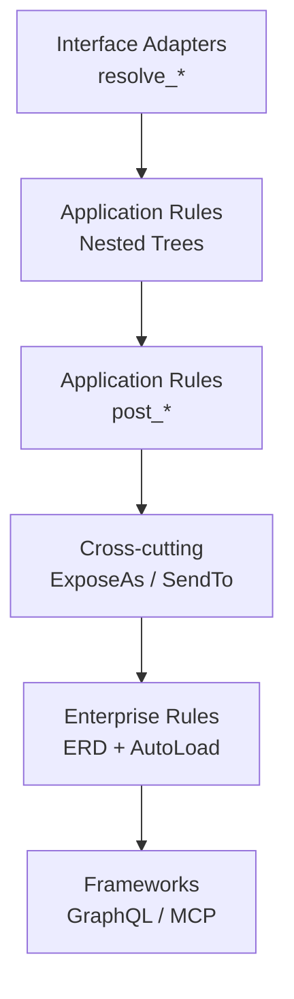
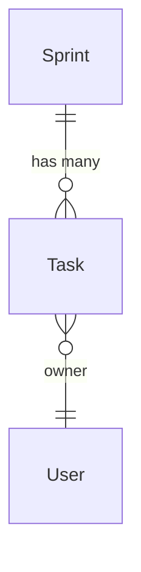

# pydantic-resolve

[中文版](./index.zh.md)

**pydantic-resolve** brings Clean Architecture to Python web development. It provides the missing Enterprise Business Rules layer, automatic data assembly via Resolver, and unified data access through Loaders — eliminating N+1 queries as a natural byproduct.

The framework maps directly to Clean Architecture's four layers: `resolve_*` is your Interface Adapter, `post_*` is your Application Business Rules, and ER Diagram + `AutoLoad` is your Enterprise Business Rules. The same ERD also powers GraphQL queries and MCP services.

## What pydantic-resolve Gives You

| Need | What you write | Clean Architecture Layer | What the framework does |
|------|----------------|--------------------------|-------------------------|
| Load related data | `resolve_*` + `Loader(...)` | Interface Adapters | Batch lookups and map results back |
| Compute derived fields | `post_*` | Application Business Rules | Run after descendants are fully resolved |
| Share data across layers | `ExposeAs`, `SendTo`, `Collector` | Cross-cutting | Pass context down or aggregate data up |
| Reuse relationship declarations | ER Diagram + `AutoLoad` | Enterprise Business Rules | Centralize relationship wiring for many models |

## The Clean Architecture Layer Map

| Clean Architecture Layer | pydantic-resolve Component | Guide Page |
|--------------------------|---------------------------|------------|
| Enterprise Business Rules | Entity + ER Diagram | [ERD and AutoLoad](./erd_and_autoload.md) |
| Application Business Rules | Resolver + resolve/post | [Core API](./core_api.md), [Post Processing](./post_processing.md) |
| Interface Adapters | Loader (data access) | [Quick Start](./quick_start.md) |
| Frameworks & Interfaces | Response + FastAPI routes | [FastAPI Integration](./fastapi_integration.md) |

For the full architectural analysis, see [Clean Architecture for Python](./architecture_entity_first.md).

## Who Is This For

- **Backend developers** building nested response data in FastAPI or similar frameworks
- **Architects** evaluating whether Clean Architecture is practical in Python without Java-level ceremony
- **Teams** who want to adopt Clean Architecture without heavy boilerplate
- **Projects** where the same entity relationships repeat across multiple endpoints
- **Anyone** who wants business entities to be the stable core, independent of database structure

## Learning Path

Every page in the Guide section uses the same business scenario:

### Guide (Tutorial Path)

| Page | Clean Architecture Layer | Main Question |
|------|--------------------------|---------------|
| [Quick Start](./quick_start.md) | Interface Adapters | How do I fix one N+1 problem with the smallest useful amount of code? |
| [Core API](./core_api.md) | Application Business Rules | How do `resolve_*` methods compose into a nested response tree? |
| [Post Processing](./post_processing.md) | Application Business Rules | When should a field be computed in `post_*` instead of loaded in `resolve_*`? |
| [Cross-Layer Data Flow](./cross_layer_data_flow.md) | Cross-cutting | How do parent and child nodes coordinate without hard-coded traversal logic? |
| [ERD and AutoLoad](./erd_and_autoload.md) | Enterprise Business Rules | When is it worth turning repeated relationship wiring into reusable ERD declarations? |

### Advanced Topics

Once you understand the core model, these pages go deeper into specific areas:

| Page | Topic |
|---|---|
| [DataLoader Deep Dive](./dataloader_deep_dive.md) | How batching works, `build_object`/`build_list`, parameters, cloning |
| [ERD with DefineSubset](./erd_define_subset.md) | Hide internal fields while keeping centralized relationships |
| [ORM Integration](./orm_integration.md) | Auto-generate loaders from SQLAlchemy, Django, or Tortoise ORM |
| [FastAPI Integration](./fastapi_integration.md) | Use Resolver in FastAPI endpoints with dependency injection |
| [GraphQL Guide](./graphql_guide.md) | Generate and serve GraphQL from ERD |
| [MCP Service](./mcp_service.md) | Expose GraphQL APIs to AI agents |
| [UseCase MCP Service](./use_case_mcp_service.md) | Expose business services to AI agents via progressive disclosure |

### API Reference

Detailed signatures and parameters for all public APIs:

- [Resolver](./api_resolver.md) — traversal orchestrator
- [DataLoader Utilities](./api_dataloader.md) — `Loader`, `build_object`, `build_list`
- [Cross-Layer Annotations](./api_cross_layer.md) — `ExposeAs`, `SendTo`, `Collector`
- [ER Diagram](./api_erd.md) — `base_entity`, `Relationship`, `ErDiagram`, `AutoLoad`
- [DefineSubset](./api_subset.md) — `DefineSubset`, `SubsetConfig`
- [GraphQL API](./api_graphql.md) — `GraphQLHandler`, `@query`, `@mutation`
- [MCP API](./api_mcp.md) — `create_mcp_server`, `AppConfig`
- [UseCase MCP API](./api_use_case_mcp.md) — `create_use_case_graphql_mcp_server`, `UseCaseService`, `FromContext`
