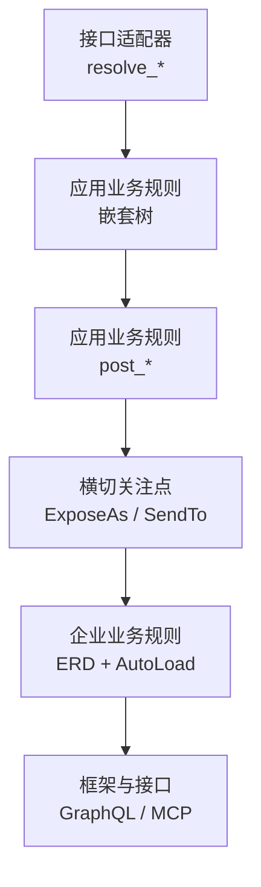
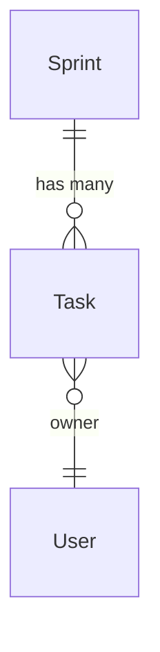

# pydantic-resolve

[English](./index.md)

**pydantic-resolve** 将整洁架构（Clean Architecture）带入 Python Web 开发。它提供了缺失的企业业务规则层，通过 Resolver 自动组装数据，通过 Loader 统一数据访问——消除 N+1 查询是其自然产物。

框架与整洁架构的四层直接对应：`resolve_*` 对应接口适配器，`post_*` 对应应用业务规则，ER Diagram + `AutoLoad` 对应企业业务规则。同一份 ERD 还能驱动 GraphQL 查询和 MCP 服务。

## pydantic-resolve 能解决什么

| 需求 | 你写什么 | 整洁架构层次 | 框架负责什么 |
|------|----------|--------------|--------------|
| 加载关联数据 | `resolve_*` + `Loader(...)` | 接口适配器 | 批量查询并把结果映射回对应节点 |
| 计算派生字段 | `post_*` | 应用业务规则 | 在后代节点全部解析完成后执行 |
| 跨层传递数据 | `ExposeAs`、`SendTo`、`Collector` | 横切关注点 | 向下传上下文，或向上聚合结果 |
| 复用关系声明 | ER Diagram + `AutoLoad` | 企业业务规则 | 将关系定义集中管理，供多个模型复用 |

## 整洁架构层次映射

| 整洁架构层次 | pydantic-resolve 组件 | 指南页面 |
|--------------|----------------------|----------|
| 企业业务规则 | Entity + ER Diagram | [ERD 与 AutoLoad](./erd_and_autoload.zh.md) |
| 应用业务规则 | Resolver + resolve/post | [核心 API](./core_api.zh.md)、[后处理](./post_processing.zh.md) |
| 接口适配器 | Loader（数据访问） | [快速开始](./quick_start.zh.md) |
| 框架与接口 | Response + FastAPI 路由 | [FastAPI 集成](./fastapi_integration.zh.md) |

完整的架构分析见 [Python 的整洁架构实现](./architecture_entity_first.zh.md)。

## 适用场景

- **后端开发者**：在 FastAPI 等框架中构建嵌套响应数据
- **架构师**：评估整洁架构在 Python 中是否可行，且不需要 Java 级别的重型框架
- **团队**：希望采用整洁架构，但不想引入大量样板代码
- **项目**：同一批实体关系在多个接口中反复出现
- **任何人**：希望业务实体成为稳定的架构核心，独立于数据库结构

## 学习路径

指南部分的每一页都复用同一套业务场景：

### 指南（教程路径）

| 页面 | 整洁架构层次 | 主要回答的问题 |
|------|--------------|----------------|
| [快速开始](./quick_start.zh.md) | 接口适配器 | 如何用最小可用代码解决一个 N+1 问题？ |
| [核心 API](./core_api.zh.md) | 应用业务规则 | 多个 `resolve_*` 方法如何组成一棵嵌套响应树？ |
| [后处理](./post_processing.zh.md) | 应用业务规则 | 一个字段什么时候应该写在 `post_*`，而不是 `resolve_*`？ |
| [跨层数据流](./cross_layer_data_flow.zh.md) | 横切关注点 | 父子节点如何在不手写遍历逻辑的情况下协作？ |
| [ERD 与 AutoLoad](./erd_and_autoload.zh.md) | 企业业务规则 | 什么时候值得把重复的关系声明提升为 ERD？ |

### 进阶指南

理解核心模型后，这些页面深入具体领域：

| 页面 | 主题 |
|---|---|
| [DataLoader 深入](./dataloader_deep_dive.zh.md) | 批量加载原理、`build_object`/`build_list`、参数、克隆 |
| [ERD 与 DefineSubset](./erd_define_subset.zh.md) | 隐藏内部字段，同时保持集中化的关系声明 |
| [ORM 集成](./orm_integration.zh.md) | 从 SQLAlchemy、Django、Tortoise ORM 自动生成 loader |
| [FastAPI 集成](./fastapi_integration.zh.md) | 在 FastAPI 接口中使用 Resolver 和依赖注入 |
| [GraphQL 指南](./graphql_guide.zh.md) | 从 ERD 生成并提供 GraphQL 服务 |
| [MCP 服务](./mcp_service.zh.md) | 将 GraphQL API 暴露给 AI 代理使用 |
| [UseCase MCP 服务](./use_case_mcp_service.zh.md) | 通过渐进式披露将业务服务暴露给 AI 代理 |

### API 参考

所有公开 API 的详细签名和参数：

- [Resolver](./api_resolver.zh.md) — 遍历编排器
- [DataLoader 工具](./api_dataloader.zh.md) — `Loader`、`build_object`、`build_list`
- [跨层注解](./api_cross_layer.zh.md) — `ExposeAs`、`SendTo`、`Collector`
- [ER 图](./api_erd.zh.md) — `base_entity`、`Relationship`、`ErDiagram`、`AutoLoad`
- [DefineSubset](./api_subset.zh.md) — `DefineSubset`、`SubsetConfig`
- [GraphQL API](./api_graphql.zh.md) — `GraphQLHandler`、`@query`、`@mutation`
- [MCP API](./api_mcp.zh.md) — `create_mcp_server`、`AppConfig`
- [UseCase MCP API](./api_use_case_mcp.zh.md) — `create_use_case_graphql_mcp_server`、`UseCaseService`、`FromContext`
