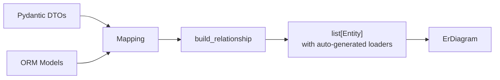

# ORM Integration

[中文版](./orm_integration.zh.md)

When your ORM already knows the relationships between tables, `build_relationship()` inspects ORM metadata and auto-generates `Relationship` definitions and DataLoader functions — no hand-written loaders needed.

## Supported ORMs

| ORM | Import | Status |
|-----|--------|--------|
| SQLAlchemy | `pydantic_resolve.integration.sqlalchemy` | Full support |
| Django | `pydantic_resolve.integration.django` | Full support |
| Tortoise ORM | `pydantic_resolve.integration.tortoise` | Full support |

## Installation

```bash
pip install pydantic-resolve[sqlalchemy]   # SQLAlchemy
pip install pydantic-resolve[django]       # Django
pip install pydantic-resolve[tortoise]     # Tortoise ORM
```

## Goal

You have ORM models with relationships already defined:

```python
class PostORM(Base):
    __tablename__ = "posts"
    id: Mapped[int] = mapped_column(Integer, primary_key=True)
    title: Mapped[str] = mapped_column(String)
    author_id: Mapped[int] = mapped_column(ForeignKey("users.id"))
    author: Mapped["UserORM"] = relationship(back_populates="posts")
    comments: Mapped[list["CommentORM"]] = relationship(back_populates="post")
```

You want the API response to resolve `author` and `comments` without writing loaders:

```json
[
    {
        "id": 1,
        "title": "Hello World",
        "author_id": 1,
        "author": {"id": 1, "name": "Alice"},
        "comments": [
            {"id": 10, "content": "Great post!", "post_id": 1}
        ]
    }
]
```

No hand-written `resolve_author` or `resolve_comments`. The ORM metadata drives everything.

## Step 1: Define ORM Models

```python
from sqlalchemy import ForeignKey, Integer, String
from sqlalchemy.orm import DeclarativeBase, Mapped, mapped_column, relationship


class Base(DeclarativeBase):
    pass


class UserORM(Base):
    __tablename__ = "users"
    id: Mapped[int] = mapped_column(Integer, primary_key=True)
    name: Mapped[str] = mapped_column(String)
    posts: Mapped[list["PostORM"]] = relationship(back_populates="author")


class PostORM(Base):
    __tablename__ = "posts"
    id: Mapped[int] = mapped_column(Integer, primary_key=True)
    title: Mapped[str] = mapped_column(String)
    author_id: Mapped[int] = mapped_column(ForeignKey("users.id"))
    author: Mapped["UserORM"] = relationship(back_populates="posts")
    comments: Mapped[list["CommentORM"]] = relationship(back_populates="post")


class CommentORM(Base):
    __tablename__ = "comments"
    id: Mapped[int] = mapped_column(Integer, primary_key=True)
    content: Mapped[str] = mapped_column(String)
    post_id: Mapped[int] = mapped_column(ForeignKey("posts.id"))
    post: Mapped["PostORM"] = relationship(back_populates="comments")
```

## Step 2: Define Pydantic DTOs

DTOs must enable `from_attributes`:

```python
from pydantic import BaseModel, ConfigDict


class UserDTO(BaseModel):
    model_config = ConfigDict(from_attributes=True)  # (1)

    id: int
    name: str


class PostDTO(BaseModel):
    model_config = ConfigDict(from_attributes=True)

    id: int
    title: str
    author_id: int


class CommentDTO(BaseModel):
    model_config = ConfigDict(from_attributes=True)

    id: int
    content: str
    post_id: int
```

1.  Required because generated loaders return ORM instances. `model_validate` needs `from_attributes` to convert them. The `_query_meta` optimization also uses DTO field names to generate `load_only` clauses.

## Step 3: Build Relationships

```python
from sqlalchemy.ext.asyncio import async_sessionmaker, create_async_engine
from pydantic_resolve import ErDiagram, config_global_resolver
from pydantic_resolve.integration.mapping import Mapping
from pydantic_resolve.integration.sqlalchemy import build_relationship

engine = create_async_engine("sqlite+aiosqlite:///blog.db")
session_factory = async_sessionmaker(engine, expire_on_commit=False)

entities = build_relationship(  # (1)
    mappings=[
        Mapping(entity=UserDTO, orm=UserORM),
        Mapping(entity=PostDTO, orm=PostORM),
        Mapping(entity=CommentDTO, orm=CommentORM),
    ],
    session_factory=session_factory,
)

diagram = ErDiagram(entities=entities)  # (2)
AutoLoad = diagram.create_auto_load()
config_global_resolver(diagram)
```

1.  `build_relationship` inspects ORM `relationship()` declarations and generates `Entity` objects with loaders.
2.  Feed the generated entities into an `ErDiagram` and configure the resolver — same as hand-written ERD.



## Step 4: Use in Response Models

```python
from typing import Annotated, Optional


class CommentView(CommentDTO):
    pass


class PostView(PostDTO):
    author: Annotated[Optional[UserDTO], AutoLoad()] = None
    comments: Annotated[list[CommentView], AutoLoad()] = []


class UserView(UserDTO):
    posts: Annotated[list[PostView], AutoLoad()] = []
```

No `resolve_author`, no `resolve_comments`. `AutoLoad` picks up the auto-generated relationships.

## Mapping Configuration

```python
from pydantic_resolve.integration.mapping import Mapping

Mapping(
    entity=PostDTO,           # Pydantic model
    orm=PostORM,              # ORM model
    filters=[PostORM.active == True],  # Optional per-target filters
)
```

| Parameter | Type | Description |
|-----------|------|-------------|
| `entity` | `type` | Pydantic DTO class |
| `orm` | `type` | ORM model class |
| `filters` | `list \| None` | Per-target ORM filter expressions |

## build_relationship() Parameters

### SQLAlchemy

```python
from pydantic_resolve.integration.sqlalchemy import build_relationship

entities = build_relationship(
    mappings=[...],
    session_factory=async_session_factory,
    default_filter=lambda orm_kls: [orm_kls.active == True],
)
```

| Parameter | Type | Description |
|-----------|------|-------------|
| `mappings` | `list[Mapping]` | DTO to ORM mappings |
| `session_factory` | `Callable` | Returns an async `AsyncSession` |
| `default_filter` | `Callable \| None` | Receives target ORM class, returns filter expressions |

### Django

```python
from pydantic_resolve.integration.django import build_relationship

entities = build_relationship(
    mappings=[...],
    using='default',  # database alias or callable returning one
    default_filter=lambda orm_kls: [orm_kls.active == True],
)
```

| Parameter | Type | Description |
|-----------|------|-------------|
| `mappings` | `list[Mapping]` | DTO to ORM mappings |
| `using` | `Any \| None` | Database alias for `QuerySet.using()` |
| `default_filter` | `Callable \| None` | Receives target ORM class, returns filter expressions |

### Tortoise ORM

```python
from pydantic_resolve.integration.tortoise import build_relationship

entities = build_relationship(
    mappings=[...],
)
```

## Supported Relationship Types

| Relationship | SQLAlchemy | Django | Tortoise |
|-------------|-----------|--------|----------|
| Many-to-One | yes | yes | yes |
| One-to-Many | yes | yes | yes |
| One-to-One (forward) | yes | yes | yes |
| Reverse One-to-One | yes | yes | yes |
| Many-to-Many | yes | yes | yes |

## Generated Loader Behavior

Auto-generated loaders:

- Use `load_only` (SQLAlchemy) / `only` (Django) to select only DTO-declared columns
- Apply per-mapping or default filters
- Convert ORM rows to DTO via `model_validate`
- Handle both sync and async sessions

## DTO Validation

`build_relationship` validates that all required DTO fields exist as scalar columns on the ORM model:

```python
class TaskDTO(BaseModel):
    id: int
    name: str
    priority: str  # Not in ORM

# ValueError: Required DTO fields not found in ORM scalar fields
# for mapping TaskDTO -> TaskORM: priority
```

## Merging with Existing ERD

Use `ErDiagram.add_relationship()` to merge ORM-generated entities with hand-written ones:

```python
from pydantic_resolve import base_entity

BaseEntity = base_entity()

class UserEntity(BaseModel, BaseEntity):
    id: int
    name: str

# Hand-written diagram
diagram = BaseEntity.get_diagram()

# ORM-generated entities
sa_entities = build_relationship(
    mappings=[Mapping(entity=TaskDTO, orm=TaskORM)],
    session_factory=session_factory,
)

# Merge
merged_diagram = diagram.add_relationship(sa_entities)
AutoLoad = merged_diagram.create_auto_load()
config_global_resolver(merged_diagram)
```

Merge rules for entities with the same `kls`:

- **relationships**: merged by `name` (raises `ValueError` on duplicate)
- **queries**: merged by method name (raises `ValueError` on duplicate)
- **mutations**: merged by method name (raises `ValueError` on duplicate)

Entities with a new `kls` are appended.

## Limitations

- **SQLAlchemy**: Composite foreign keys are not supported (raises `NotImplementedError`)
- **SQLAlchemy**: `MANYTOMANY` without explicit `secondary` table is not supported
- Unmapped ORM targets are skipped with a warning
- Generated loaders do not support custom transformation logic — use hand-written loaders for complex cases

## When to Use ORM Integration

Use when:

- Your ORM metadata is stable and already defines all relationships
- You have many entities and want to avoid hand-writing loaders
- You want a single source of truth for relationships (the ORM)

Keep using hand-written loaders when:

- You need custom transformation or filtering logic
- Data comes from multiple sources (not just one database)
- The ORM does not match your API response structure closely

## Next

Continue to [FastAPI Integration](./fastapi_integration.md) to see how to use the resolver in FastAPI endpoints.
