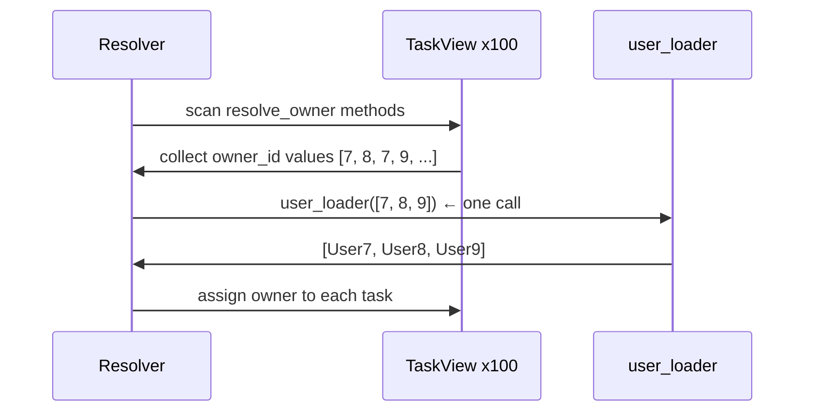

# Quick Start

[中文版](./quick_start.zh.md)

This page solves one problem: your task data has `owner_id`, but your API should return the full `owner` object — without N+1 queries.

## Goal

You have this:

```python
raw_tasks = [
    {"id": 10, "title": "Design docs", "owner_id": 7},
    {"id": 11, "title": "Refine examples", "owner_id": 8},
]
```

You want this:

```json
[
    {
        "id": 10,
        "title": "Design docs",
        "owner": {"id": 7, "name": "Ada"}
    },
    {
        "id": 11,
        "title": "Refine examples",
        "owner": {"id": 8, "name": "Bob"}
    }
]
```

The naive approach fetches one owner per task in a loop — that is the N+1 problem. pydantic-resolve solves it with three pieces: a **response model**, a **loader function**, and a **resolver**.

## Install

```bash
pip install pydantic-resolve
```

## Step 1: Declare the Missing Field

Start with a Pydantic model. The `owner` field is `None` because the raw data does not include it. You declare how to fill it with `resolve_owner`:

```python
from typing import Optional
from pydantic import BaseModel
from pydantic_resolve import Loader, Resolver, build_object


class UserView(BaseModel):
    id: int
    name: str


class TaskView(BaseModel):
    id: int
    title: str
    owner_id: int
    owner: Optional[UserView] = None  # (1)

    def resolve_owner(self, loader=Loader(user_loader)):  # (2)
        return loader.load(self.owner_id)
```

1.  `owner` starts as `None` — the resolver will fill it.
2.  `resolve_<field_name>` declares how to load the field. `loader.load(self.owner_id)` registers a key to be batched — it does **not** call `user_loader` immediately.

!!! tip "Mental model"

    **`resolve_*` means: this field needs data from outside the current node.**

    The rest of the library builds on this idea:
    `post_*` runs after the subtree is ready, `AutoLoad` removes the need to write `resolve_*` at all.

## Step 2: Write a Loader Function

The loader receives a **batch** of keys and returns results in the same order:

```python
USERS = {
    7: {"id": 7, "name": "Ada"},
    8: {"id": 8, "name": "Bob"},
    9: {"id": 9, "name": "Cara"},
}


async def user_loader(user_ids: list[int]):
    users = [USERS.get(uid) for uid in user_ids]
    return build_object(users, user_ids, lambda user: user.id)
```

`build_object` aligns results with keys — it returns one element per key, or `None` if no match.

## Step 3: Run the Resolver

Wire it together:

```python
raw_tasks = [
    {"id": 10, "title": "Design docs", "owner_id": 7},
    {"id": 11, "title": "Refine examples", "owner_id": 8},
]

tasks = [TaskView.model_validate(t) for t in raw_tasks]
tasks = await Resolver().resolve(tasks)

for t in tasks:
    print(t.model_dump())
```

Output:

```python
{'id': 10, 'title': 'Design docs', 'owner_id': 7, 'owner': {'id': 7, 'name': 'Ada'}}
{'id': 11, 'title': 'Refine examples', 'owner_id': 8, 'owner': {'id': 8, 'name': 'Bob'}}
```

## How the Batch Works

With 100 tasks, the resolver does **not** call `user_loader` 100 times:



1.  Collect all `owner_id` values across tasks.
2.  Call `user_loader` **once** with deduplicated keys.
3.  Map each user back to the matching task.

## With FastAPI

Drop the same models into a route:

```python
from fastapi import FastAPI

app = FastAPI()


@app.get("/tasks", response_model=list[TaskView])
async def get_tasks():
    tasks = [TaskView.model_validate(t) for t in await db.get_tasks()]
    return await Resolver().resolve(tasks)
```

The route does not import SQLAlchemy, does not write join logic, and does not think about loading strategies. It only declares business semantics.

## Sync or Async

`resolve_*` supports both forms:

```python
# Sync — return a loader call directly
def resolve_owner(self, loader=Loader(user_loader)):
    return loader.load(self.owner_id)

# Async — transform the result before assignment
async def resolve_owner(self, loader=Loader(user_loader)):
    user = await loader.load(self.owner_id)
    return user
```

Use async when you need to post-process the loaded data.

## Next

- [Core API](./core_api.md) — extend the same pattern to nested trees: `Sprint -> Task -> User`.
- [Post Processing](./post_processing.md) — compute derived fields after all data is loaded.
