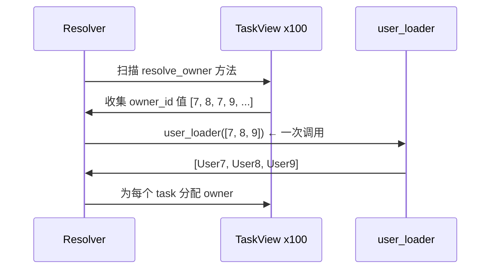

# 快速开始

[English](./quick_start.md)

本页解决一个问题：你的 task 数据有 `owner_id`，但 API 应该返回完整的 `owner` 对象 —— 且不会产生 N+1 查询。

## 目标

你有这样的数据：

```python
raw_tasks = [
    {"id": 10, "title": "Design docs", "owner_id": 7},
    {"id": 11, "title": "Refine examples", "owner_id": 8},
]
```

你想要这样的响应：

```json
[
    {
        "id": 10,
        "title": "Design docs",
        "owner": {"id": 7, "name": "Ada"}
    },
    {
        "id": 11,
        "title": "Refine examples",
        "owner": {"id": 8, "name": "Bob"}
    }
]
```

朴素做法是在循环中逐个获取 owner —— 这就是 N+1 问题。pydantic-resolve 用三个部分解决它：**响应模型**、**loader 函数**和**解析器**。

## 安装

```bash
pip install pydantic-resolve
```

## Step 1：声明缺失字段

从一个 Pydantic 模型开始。`owner` 字段初始为 `None`，因为原始数据不包含它。你通过 `resolve_owner` 声明如何填充它：

```python
from typing import Optional
from pydantic import BaseModel
from pydantic_resolve import Loader, Resolver, build_object


class UserView(BaseModel):
    id: int
    name: str


class TaskView(BaseModel):
    id: int
    title: str
    owner_id: int
    owner: Optional[UserView] = None  # (1)

    def resolve_owner(self, loader=Loader(user_loader)):  # (2)
        return loader.load(self.owner_id)
```

1.  `owner` 初始为 `None` —— 解析器会填充它。
2.  `resolve_<field_name>` 声明如何加载该字段。`loader.load(self.owner_id)` 注册一个待批处理的 key —— 它**不会**立即调用 `user_loader`。

!!! tip "心智模型"

    **`resolve_*` 的含义是：这个字段需要从当前节点之外获取数据。**

    库中的其他功能都建立在这个想法之上：
    `post_*` 在子树准备好之后运行，`AutoLoad` 可以完全消除编写 `resolve_*` 的需要。

## Step 2：编写 Loader 函数

loader 接收一个**批量**的 key，并按相同顺序返回结果：

```python
USERS = {
    7: {"id": 7, "name": "Ada"},
    8: {"id": 8, "name": "Bob"},
    9: {"id": 9, "name": "Cara"},
}


async def user_loader(user_ids: list[int]):
    users = [USERS.get(uid) for uid in user_ids]
    return build_object(users, user_ids, lambda user: user.id)
```

`build_object` 将结果与 key 对齐 —— 每个 key 返回一个元素，没有匹配则返回 `None`。

## Step 3：运行解析器

将它们组合起来：

```python
raw_tasks = [
    {"id": 10, "title": "Design docs", "owner_id": 7},
    {"id": 11, "title": "Refine examples", "owner_id": 8},
]

tasks = [TaskView.model_validate(t) for t in raw_tasks]
tasks = await Resolver().resolve(tasks)

for t in tasks:
    print(t.model_dump())
```

输出：

```python
{'id': 10, 'title': 'Design docs', 'owner_id': 7, 'owner': {'id': 7, 'name': 'Ada'}}
{'id': 11, 'title': 'Refine examples', 'owner_id': 8, 'owner': {'id': 8, 'name': 'Bob'}}
```

## 批处理如何工作

假设有 100 个 task，解析器**不会**调用 `user_loader` 100 次：



1.  收集所有 task 中的 `owner_id` 值。
2.  用去重后的 key **一次性**调用 `user_loader`。
3.  将每个 user 映射回对应的 task。

## 配合 FastAPI

将同样的模型放入路由：

```python
from fastapi import FastAPI

app = FastAPI()


@app.get("/tasks", response_model=list[TaskView])
async def get_tasks():
    tasks = [TaskView.model_validate(t) for t in await db.get_tasks()]
    return await Resolver().resolve(tasks)
```

路由不导入 SQLAlchemy，不编写 join 逻辑，也不考虑加载策略。它只声明业务语义。

## 同步或异步

`resolve_*` 支持两种形式：

```python
# 同步 —— 直接返回 loader 调用
def resolve_owner(self, loader=Loader(user_loader)):
    return loader.load(self.owner_id)

# 异步 —— 在赋值前转换结果
async def resolve_owner(self, loader=Loader(user_loader)):
    user = await loader.load(self.owner_id)
    return user
```

当你需要对加载的数据进行后处理时，使用异步形式。

## 下一步

- [核心 API](./core_api.zh.md) —— 将同样的模式扩展到嵌套树：`Sprint -> Task -> User`。
- [后处理](./post_processing.zh.md) —— 在所有数据加载完成后计算派生字段。
