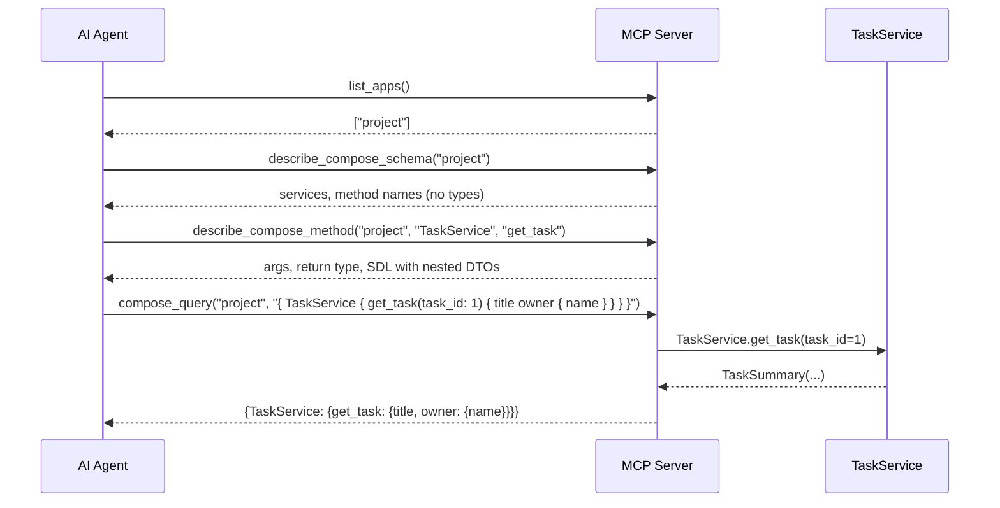
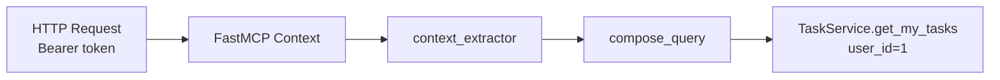

# UseCase MCP Service

[中文版](./use_case_mcp_service.zh.md)

This page solves one problem: you have business service methods powering FastAPI routes, and you want to expose the same logic to AI agents — without duplicating code.

## Goal

You have this:

```python
class TaskService(UseCaseService):
    @query
    async def list_tasks(cls) -> list[TaskSummary]:
        ...

    @query
    async def get_task(cls, task_id: int) -> TaskSummary | None:
        ...
```

You want AI agents to discover and call these methods through a standard MCP protocol:

```
Agent → "What apps are available?"
      → list_apps() → ["project"]

Agent → "What can TaskService do?"
      → describe_compose_schema("project")
      → [list_tasks(), get_task(task_id)]

Agent → "Show me task 1's title and owner"
      → describe_compose_method("project", "TaskService", "get_task")
      → args, return type, SDL with nested DTOs

Agent → compose_query("project", "{ TaskService { get_task(task_id: 1) { title owner { name } } } }")
      → {TaskService: {get_task: {title: "...", owner: {name: "..."}}}}
```

The same `TaskService` classmethods power both FastAPI routes and MCP tool calls. Business logic lives in one place.

## Install

```bash
pip install pydantic-resolve[mcp]
```

## Step 1: Define Services

Create service classes with `@query` and `@mutation` decorators. Docstrings become descriptions visible to AI agents:

```python
from pydantic import BaseModel
from pydantic_resolve import query
from pydantic_resolve.use_case import UseCaseService


class UserSummary(BaseModel):
    id: int
    name: str


class TaskSummary(BaseModel):
    id: int
    title: str
    owner_name: str


class UserService(UseCaseService):  # (1)
    """User management service."""

    @query  # (2)
    async def list_users(cls) -> list[UserSummary]:
        """Get all users."""
        ...


class TaskService(UseCaseService):
    """Task management service."""

    @query
    async def list_tasks(cls) -> list[TaskSummary]:
        """Get all tasks."""
        ...

    @query
    async def get_task(cls, task_id: int) -> TaskSummary | None:
        """Get a task by ID."""
        ...
```

1.  `UseCaseService` uses a metaclass to discover methods decorated with `@query` or `@mutation`.
2.  The docstring becomes the tool description that AI agents see.

## Step 2: Create MCP Server

```python
from pydantic_resolve.use_case import UseCaseAppConfig, create_use_case_graphql_mcp_server

mcp = create_use_case_graphql_mcp_server(  # (1)
    apps=[
        UseCaseAppConfig(
            name="project",  # (2)
            services=[UserService, TaskService],  # (3)
            description="Project management with users and tasks",
        ),
    ],
    name="Project UseCase GraphQL API",
)

mcp.run(transport="streamable-http", port=8080)  # (4)
```

1.  `create_use_case_graphql_mcp_server` scans services and registers four discovery tools.
2.  `name` is the app identifier agents use to target a specific group of services.
3.  Pass service classes directly — no need to instantiate them.
4.  Starts an HTTP server that MCP clients connect to.

## How the Discovery Works

The MCP server exposes four tools that guide AI agents through a discovery funnel:



1.  `list_apps` — cheap app discovery (names + service counts).
2.  `describe_compose_schema` — list services and methods for an app (compact: names + descriptions only).
3.  `describe_compose_method` — full detail for one method: args, return type, and an `sdl` string showing the method signature plus every nested DTO reachable from its return type.
4.  `compose_query` — execute a GraphQL data query against the compose surface. Fixed 3-level hierarchy: `Query → Service → Method → DTO field selection`.

!!! tip "Schema discovery is not introspection"

    `compose_query` rejects GraphQL introspection (`__schema`, `__type`, `__typename`). Schema discovery flows through Layers 2 and 3. The `sdl` field in `describe_compose_method` is the source of truth for valid field names — top-level and nested alike.

## FromContext: Inject Request Context

When a method needs user identity or other request-scoped data, mark parameters with `FromContext`:

```python
from typing import Annotated
from pydantic_resolve.use_case import FromContext


class TaskService(UseCaseService):
    @query
    async def get_my_tasks(
        cls,
        user_id: Annotated[int, FromContext()],  # (1)
    ) -> list[TaskSummary]:
        """Get tasks owned by the authenticated user."""
        ...
```

1.  `FromContext()` tells the MCP server to inject this parameter from the request context, not from the GraphQL query.

Then configure a `context_extractor` on the app:

```python
from fastmcp.server.context import Context
from fastmcp.server.dependencies import get_http_headers


def extract_user_context(ctx: Context) -> dict:
    headers = get_http_headers(include={"authorization"})  # (1)
    auth = headers.get("authorization", "")
    if auth.startswith("Bearer "):
        token = auth[7:]
        return {"user_id": int(token)}
    return {}


mcp = create_use_case_graphql_mcp_server(
    apps=[
        UseCaseAppConfig(
            name="project",
            services=[TaskService],
            context_extractor=extract_user_context,  # (2)
        ),
    ],
)
```

1.  `get_http_headers()` excludes `authorization` by default. Pass `include={"authorization"}` to receive it.
2.  The extractor runs on every request. Its return dict is merged into method kwargs.

Data flow:



The method signature stays identical for FastAPI usage — just pass `user_id` directly:

```python
from fastapi import Depends

@app.get("/my-tasks")
async def my_tasks(user_id: int = Depends(get_current_user_id)):
    return await TaskService.get_my_tasks(user_id=user_id)
```

## Share Services with FastAPI

The same classmethods power both HTTP API and MCP:

```python
from pydantic_resolve.utils.types import get_return_annotation


@app.get("/api/tasks", tags=[TaskService.get_tag_name()])
async def get_tasks():
    return await TaskService.list_tasks()


@app.get(
    "/api/tasks/{task_id}",
    response_model=get_return_annotation(TaskService.get_task),  # (1)
    tags=[TaskService.get_tag_name()],
)
async def get_task(task_id: int):
    result = await TaskService.get_task(task_id=task_id)
    if result is None:
        raise HTTPException(status_code=404)
    return result
```

1.  `get_return_annotation` extracts the return type from the classmethod, so you can use it as FastAPI's `response_model` without repeating the type.

## Control Mutation Visibility

To hide mutation methods from AI agents, set `enable_mutation=False`:

```python
from pydantic_resolve import query, mutation


class TaskService(UseCaseService):
    @query
    async def list_tasks(cls) -> list[TaskSummary]:
        ...

    @mutation
    async def create_task(cls, title: str) -> TaskSummary:
        ...


mcp = create_use_case_graphql_mcp_server(
    apps=[
        UseCaseAppConfig(
            name="readonly-project",
            services=[TaskService],
            enable_mutation=False,  # (1)
        ),
    ],
)
```

1.  When `enable_mutation=False`: `describe_compose_schema` omits mutation methods, `describe_compose_method` returns an error if one is targeted, and `compose_query` rejects mutations.

## Multi-App Support

Serve multiple independent application groups from one MCP server:

```python
mcp = create_use_case_graphql_mcp_server(
    apps=[
        UseCaseAppConfig(name="project", services=[SprintService, TaskService]),
        UseCaseAppConfig(name="admin", services=[UserService, RoleService]),
    ],
    name="My Platform",
)
```

Each app has its own services and optional `context_extractor`.

## Composing Multi-Service Queries

The `compose_query` tool executes a single GraphQL query that can fan out across services and methods in one round trip:

```python
compose_query(
    app_name="project",
    query='''
    {
      SprintService {
        list_sprints { id name }
        get_sprint(sprint_id: 1) { name }
      }
      TaskService {
        get_task(task_id: 1) { title owner_id }
        list_tasks { title }
      }
    }
    ''',
)
```

**Execution semantics:**

- `@query` methods run concurrently.
- `@mutation` methods run serially in declaration order.
- Relative ordering between queries and mutations within a single call is NOT guaranteed — split into separate calls for create-then-read flows.

## GraphQL MCP vs UseCase MCP

| | GraphQL MCP | UseCase MCP |
|---|---|---|
| Input | ER Diagram | `UseCaseService` classes |
| Query | Full GraphQL | GraphQL compose (fixed 3-level: Service → Method → DTO fields) |
| Best for | Flexible ad-hoc queries | Fixed business operations |
| Setup | `create_mcp_server` + ERD | `create_use_case_graphql_mcp_server` + services |

If you already have `UseCaseService` classes powering your FastAPI endpoints, UseCase MCP is the natural choice — zero duplication.

## Next

- [UseCase MCP API](./api_use_case_mcp.md) — detailed API signatures.
- [MCP Service](./mcp_service.md) — the ER-diagram-driven GraphQL MCP approach.
